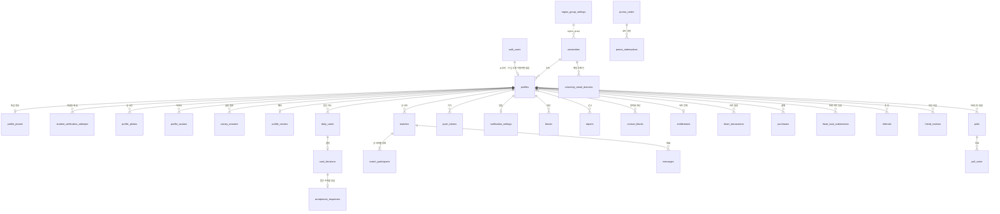
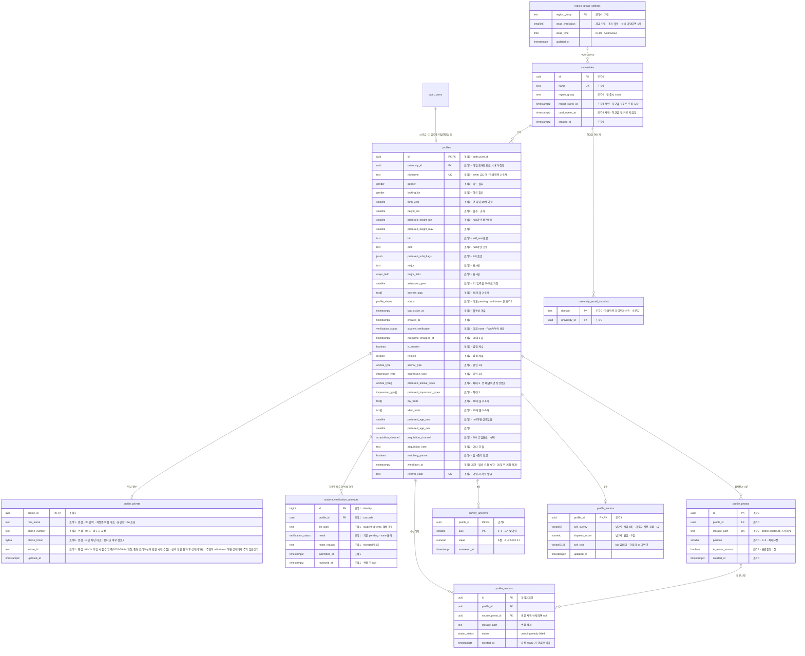
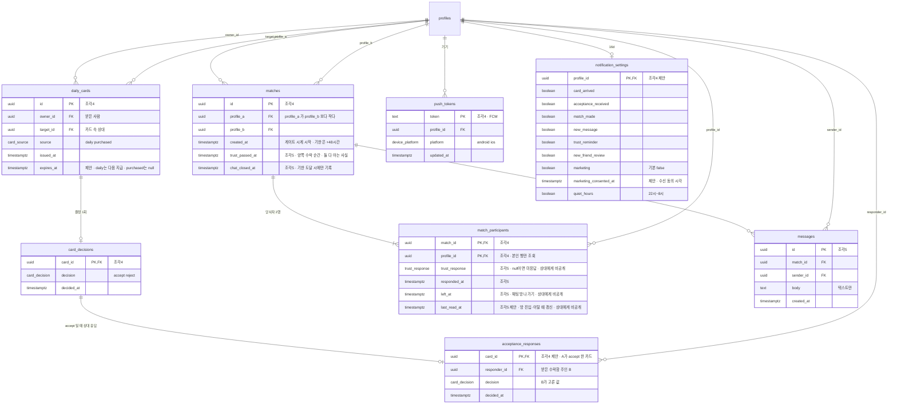
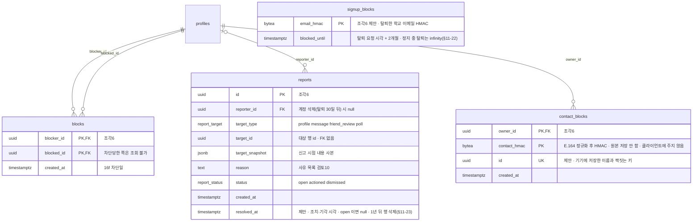
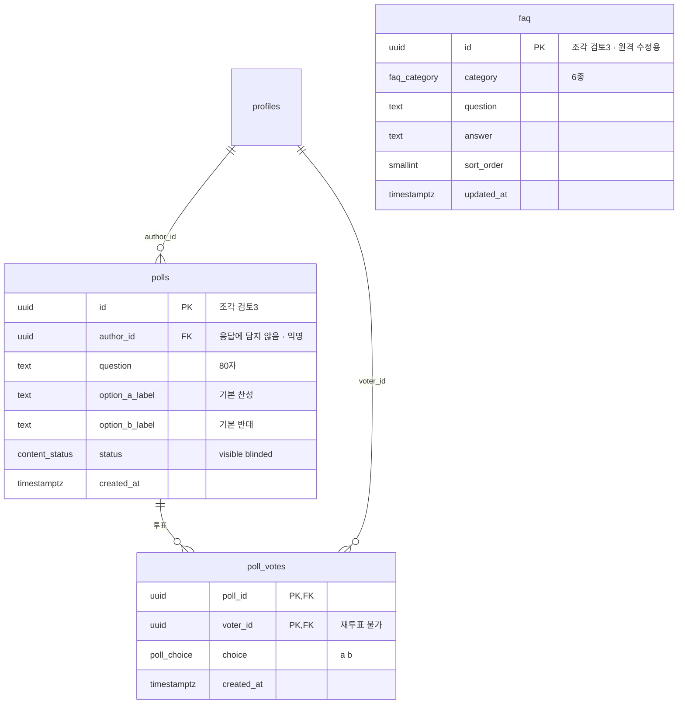

# CampusMate DB ERD

> **상태: 초안 v3 (2026-09-13 ~ 09-14) · 2차 검수 반려 반영 · 최종 검토 반영 · 탈퇴 정책 결정 반영 · 조각 0 Supabase 적용 완료(2026-09-14, MCP apply_migration + seed) · 조각 1 초안 작성, 미적용.** 조각 0 은 `supabase/migrations/` 4개 + `seed.sql` 로 적용됐다. 조각 1 은 마이그레이션 초안 5개(`20260914055607` ~ `061304`)와 `supabase/tests/rls_slice1_test.sql` 을 작성만 했다(2026-09-14, 클라우드 미적용 · pgTAP 미실행). 조각 2 이후는 파일 없음.
> 근거: 설계 문서 `docs/superpowers/specs/2026-09-05-campusmate-foundation-design.md` (§2·§5·§6·§7·§13), `frontend/docs/DESIGN.md` (§5.2·§8·§9), 2026-09-13 ~ 09-14 사용자 결정(§11).

## 읽는 법

- 컬럼 주석 맨 앞의 **`조각N`** = 그 컬럼·테이블을 추가하는 조각. 조각을 시작할 때 추가한다(설계 §5.4)
- **`제안`** = 스펙에 없어서 이 ERD가 제안하는 것
- **`검토N`** = 아직 정해지지 않은 것. 번호는 §12 "남은 검토"
- **`민감`** = 남에게 가는 응답에 절대 담지 않는 값(설계 §7.1). 민감 값은 `profile_private` 에만 둔다
- 컬럼 없이 계산하는 값: 가입 나이 자격(Asia/Seoul 기준 올해 − `birth_year` ≥ 19, FastAPI 검사), 신뢰 확인 기한(`matches.created_at` + 48시간), 안 읽은 메시지 수(상대가 보낸 메시지 중 `created_at` > 내 `match_participants.last_read_at`), 아바타 교체 무료 여부(`profile_avatars` 성공 건수), 주기당 추가 카드 1장(`daily_cards.source`), 월간 추천 랭킹(`referrals` 집계, 탈퇴자 제외 §3. 계정 삭제 cascade 로 지난달 행이 줄 수 있어 월말에 순위를 확정해 지급한다 — 조각 7)

## 1. 조감도

관계가 없는 독립 테이블: `signup_blocks`(탈퇴 후 재가입 제한), `faq`.

## 2. 접근 경로와 RLS

**원칙 (2026-09-13 사용자 결정, §11-8)**

- **쓰기는 전부 FastAPI** 가 검증한 뒤 `service_role` 로 한다. 클라이언트(`authenticated`)에는 INSERT·UPDATE·DELETE 정책을 하나도 두지 않는다. 사용자가 API를 직접 호출해 자기 `status`·`university_id`·인증 상태를 바꾸는 우회가 여기서 막힌다(설계 §7.3·§7.6)
- **클라이언트가 직접 읽는 건 본인 데이터뿐이다.** 정책은 `to authenticated using ((select auth.uid()) = <본인 컬럼>)` 꼴
- **남의 데이터는 FastAPI가 필요한 컬럼만 골라 준다** — 카드 속 상대, 받은 수락함, 매칭 상대의 사진·카카오톡 아이디, 투표 집계, 지인 리뷰. `security definer` 함수는 쓰지 않는다(frontend/CLAUDE.md §10.1)
- **RLS는 컬럼을 가리지 못한다.** 두 사람이 같은 행을 읽는 테이블에는 둘 다 알아도 되는 값만 둔다(`matches` ↔ `match_participants`). 본인 행 안에서도 내려보내지 않을 컬럼은 컬럼 단위 grant 로 뺀다
- **탈퇴 삭제 규칙(§11-11 · §11-15).** 탈퇴하면 FastAPI 가 계정을 `withdrawn` 으로 바꾸고 30일 뒤 `auth.users` 를 지운다. 아래 FK 규칙은 그 삭제 때 적용된다. `profiles` 를 가리키는 FK 와, 탈퇴로 지워지는 행을 가리키는 하위 FK(`card_decisions.card_id` · `acceptance_responses.card_id` · `match_participants.match_id` · `messages.match_id` · `poll_votes.poll_id`)는 `on delete cascade` 다. 하나라도 기본값(no action)으로 두면 `auth.users` 삭제가 23503 으로 실패해 탈퇴가 막힌다. 예외는 `reports.reporter_id`(set null, 신고 근거 보존), `profile_avatars.source_photo_id`(set null, §3), `purchases.profile_id`(set null, 결제 내역 5년 보관, §11-14)다. `profiles` 행은 `auth.users` 를 따라 cascade 로 지워진다
- **grant 도 이 표를 따르고, RLS 와 같은 마이그레이션에 둔다.** 새 테이블에 `anon`·`authenticated` 권한이 자동으로 붙는지는 프로젝트 설정에 따라 달라서 믿지 않는다(Supabase 문서 Securing your API). 테이블마다 `revoke all ... from anon, authenticated, service_role` 뒤에 필요한 것만 준다. `service_role` 까지 revoke 해야 자동 grant 유무(프로젝트 설정·적용 시점)와 상관없이 결과가 같다
  - `service_role`: 전 테이블 `select` · `insert` · `update` · `delete`
  - `authenticated`: 아래 표에서 읽기가 있는 테이블만 `select`
  - `anon`: `universities` · `university_email_domains` 만 `select`
  - `anon` · `authenticated` 에는 `insert` · `update` · `delete` 를 주지 않는다. 클라이언트 쓰기는 정책이 아니라 권한에서 막혀 오류(42501)로 끝난다

| 테이블 | 클라이언트 읽기 | 비고 |
| --- | --- | --- |
| `universities` · `university_email_domains` | `anon` · `authenticated` 전체 | 가입 화면의 학교·도메인 확인 |
| `region_group_settings` | `authenticated` 전체 | 다음 지급 시각 표시 |
| `profiles` | 본인 행 (`id`) | |
| `profile_private` | 본인 행 (`profile_id`) · 컬럼 grant `profile_id` · `real_name` 만 | 16e 본인 실명 조회. 번호 암호문·`phone_hmac`·카카오톡 아이디는 내려가지 않는다. 앱은 `select *` 대신 컬럼을 지정한다. 본인 `kakao_id`(16e · 14f · 16e-1)는 FastAPI 가 내려준다(§11-20) |
| `student_verification_attempts` | 없음 | FastAPI 전용 — 본인 반려 사유는 FastAPI 응답으로 내려주고, 재시도 횟수는 행 수로 FastAPI 가 센다(§12-4) |
| `profile_photos` · `profile_avatars` · `survey_answers` | 본인 행 (`profile_id`) | |
| `profile_vectors` | 없음 | FastAPI 전용 |
| `daily_cards` · `card_decisions` · `acceptance_responses` | 없음 | FastAPI 전용 — 카드 화면에는 상대 정보가 섞인다 |
| `matches` | 당사자 (`profile_a` · `profile_b`) | 둘 다 알아도 되는 값만 있다 |
| `match_participants` | 본인 행 (`profile_id`) | 상대의 게이트 응답·채팅방 나가기는 보이지 않는다 |
| `messages` | 참여 중인 매칭의 메시지 | `exists (select 1 from match_participants mp where mp.match_id = messages.match_id and mp.profile_id = (select auth.uid()) and mp.left_at is null)` |
| `push_tokens` | 없음 | FastAPI 전용 |
| `notification_settings` | 본인 행 | |
| `blocks` · `reports` | 없음 | FastAPI 전용 — 차단 목록(16f)은 상대 닉네임이 필요하다 |
| `contact_blocks` | 본인 행 (`owner_id`) · 컬럼 grant `id` · `owner_id` · `created_at` 만 | 16b 목록. `contact_hmac` 은 내려가지 않는다 |
| `entitlements` · `heart_transactions` · `purchases` · `heart_task_submissions` | 본인 행 | 잔액·내역·인증 상태 |
| `referrals` · `friend_reviews` | 없음 | FastAPI 전용 |
| `polls` · `poll_votes` | 없음 | FastAPI 전용 — `author_id` 를 열면 익명이 깨지고(DESIGN §8.11), `poll_votes` 는 본인 행만 열면 집계가 안 되고 다 열면 누가 뭘 골랐는지 보인다 |
| `faq` | `authenticated` 전체 | |
| `signup_blocks` · `promo_codes` · `promo_redemptions` | 없음 | 서버 전용 |

사이클 B pgTAP 기대값의 기준:

- 읽기가 있는 테이블: 남의 행 0행. `match_participants` 는 같은 매칭 상대의 행도 0행, `messages` 는 비당사자와 `left_at` 이 찍힌 본인 모두 0행
- 읽기가 없는 테이블(FastAPI · 서버 전용): 본인 행이라도 `select` 가 42501
- 컬럼 grant 테이블: `profile_private` 에서 본인 `select real_name` 은 1행, `select *` 는 42501(조각 1). 본인 `select kakao_id` 도 42501(§11-20)
- 모든 테이블: `anon` · `authenticated` 의 INSERT · UPDATE · DELETE 가 42501
- `anon` 은 `universities` · `university_email_domains` 읽기만 된다
- `profiles` 제약: 온보딩 컬럼 없는 `pending` 행 insert 는 성공, 필수값 없이 `active` 로 바꾸면 check 위반, 대소문자만 다른 닉네임은 unique 위반(§3)
- `service_role` 은 테이블마다 `select` · `insert` · `update` · `delete` 가 모두 있다. 하나라도 빠지면 FastAPI 쓰기가 깨진다
- `profile-photos` · `student-id-temp` 버킷은 비공개이고 `storage.objects` 에는 정책이 없다(§9). `student-id-temp` 는 10MB · `image/jpeg` · `image/png` 제한이 걸린다
- 계정 삭제 cascade(탈퇴 30일 뒤, §11-15): `auth.users` 행을 지우면 `profiles` · `profile_photos` · `profile_private` · `student_verification_attempts` 행이 함께 지워진다

## 3. 계정 · 프로필 (조각 0~3)

- `profiles` 폐기 컬럼 — 만들지 않는다: `hide_same_major`(설계 §5.3·미결27), `ideal_description`(§5.3·미결33)
- `profiles` 행은 FastAPI가 이메일 인증 직후 만든다. 3b의 `profile_private` 가 이 행을 FK로 가리키므로 먼저 있어야 한다. 클라이언트 INSERT는 없다(§2)
- **이 시점에 정해지는 `university_id`(메일 도메인으로) · `status`(`pending`)만 `not null` 이다.** 온보딩(DESIGN 04-1 이후)에서 받는 `nickname` · `gender` · `looking_for` · `birth_year` · `height_cm` 는 null 허용이고, 아래 check 로 필수값 없는 `active` 전환을 막는다. 계획서 Task 7 의 `not null` 을 그대로 옮기면 FastAPI insert가 실패한다
  `check (status <> 'active' or (nickname is not null and gender is not null and looking_for is not null and birth_year is not null and height_cm is not null))`
- 가입 나이의 "올해"는 Asia/Seoul 기준이다(UTC 12월 31일 15:00 경계). check 에 `now()` 를 넣지 않고 FastAPI가 검사한다. DB에는 `now()` 없는 정적 범위 check만 둔다
- `profiles` 정적 check(조각 0): `nickname` 한글·영문 2~5자, `birth_year` 1950~2020, `height_cm` 120~230, `preferred_height_min` · `max` 도 120~230 이고 min ≤ max, `admission_year` 1950~2100(두 자리 입력을 그대로 저장하는 실수 방지), `mbti` `^[EI][NS][TF][JP]$`, `preferred_mbti_flags` 는 JSON 객체(키 E I N S T F J P, 값 boolean · true 가 ok, 설계 §6.4 — 기본 `{}` 는 전부 ok 와 같은 결과), `interest_tags` 5개 이하(하한 3개는 FastAPI 온보딩 완료 검사)
- 선호 키·나이 슬라이더(DESIGN `range-slider` 프리셋)의 끝 표기 "150cm 이하" · "190cm 이상" · "35세 이상"은 그쪽 경계를 null 로 저장한다. 끝값 150 을 그대로 저장하면 145cm 상대가 빠진다
- `profiles.university_id` 는 `on delete restrict` — 프로필이 남아 있는 대학은 지울 수 없다. `university_email_domains` 는 대학을 따라 cascade 로 지워진다
- `universities.name` 은 unique 다(시드가 이름으로 도메인을 짝짓는다). `university_email_domains.domain` 은 소문자 도메인 형식 check `^[a-z0-9-]+(\.[a-z0-9-]+)+$`. 도메인 1개는 대학 1개에만 속하고, 서울 밖 캠퍼스도 따로 나누지 않는다(§11-10)
- 조각 4에서 `universities.region_group` 에 `region_group_settings` FK 를 걸 때는 같은 마이그레이션에서 `seoul` 행을 먼저 넣는다
- 민감 값(`real_name` · `phone_number` · `phone_hmac` · `kakao_id`)은 `profile_private` 로 분리했다. 서버 코드가 남의 프로필을 `select *` 로 읽어도 민감 값이 딸려 나오지 않는다. 접근 감사 로그는 테이블 없이 FastAPI 구조화 로그로 남긴다(§11-13). 운영자도 FastAPI 관리 기능으로만 조회하고 Supabase 대시보드·SQL 로 직접 보지 않는다(§11-18)
- `student_verification` 은 boolean이 아니라 상태값(`none` `pending` `verified` `rejected`, 2026-09-14 확정)이다. 3b의 "조금 더 확인이 필요해요" 대기 상태를 담아야 하기 때문이다
- `student_verification_attempts` 는 학생증 제출 한 번에 한 행이다(§12-4, 2026-09-14 사용자 결정). 재시도 횟수(설계 미결3)는 이 테이블의 행 수로 FastAPI 가 세고, 반려 사유(`reject_reason`)는 본인에게 FastAPI 응답으로 내려준다. `result` 는 제출 직후 `pending` 이고 `none` 일 수 없다(check). 클라이언트 권한은 없다(§2)
- `profile_photos` 장수 2~4장: 상한은 `position` 범위로, 하한은 FastAPI 온보딩 완료 검사로 막는다
- `profile_photos` 는 `unique (profile_id, position) deferrable initially deferred` — 순서를 맞바꿀 때 중간 충돌을 피한다. `storage_path` 는 unique — 두 행이 같은 파일을 가리키면 한 행을 지울 때 남은 행의 사진도 사라진다
- `profile_photos.is_avatar_source` 는 부분 유니크 인덱스 `(profile_id) where is_avatar_source` 로 1장만 허용
- **아바타 원본으로 고른 사진도 신뢰 확인을 통과하면 다른 실사진과 함께 공개한다**(§11-5). 어느 사진이 원본인지는 상대에게 드러내지 않는다
- `profile_vectors` 는 벡터 2종(§6.3)을 한 행에 둔다(1:1)
- **탈퇴는 30일 뒤에 지운다(§11-15).** 탈퇴하면 FastAPI 가 `status = withdrawn` · `withdrawn_at` 을 쓰고, 세션을 끊고 다시 로그인하거나 토큰을 갱신하지 못하게 막는다(Supabase Auth ban 전제, 토큰 갱신까지 막히는지는 조각 6에서 확인). 이미 발급된 access token 은 만료(`jwt_expiry`)까지 살아 있어 그동안 RLS 로 본인 행은 읽힌다. 본인 데이터라 RLS 에 status 조건은 넣지 않는다. `withdrawn` 계정의 요청은 FastAPI 가 받지 않는다
  - 즉시 빠지는 곳: `active` 가 아니므로 카드 · 받은 수락함 · 매칭 생성 · 투표 글 · 투표 집계 · 지인 리뷰 노출에서 빠진다. `push_tokens` 는 탈퇴 즉시 지운다
  - 게이트: 상대가 `withdrawn` 이면 게이트를 통과시키지 않는다. 이미 통과한 매칭에서도 탈퇴자의 `kakao_id` 와 실사진 서명 URL 은 더 주지 않는다
  - 남은 상대: 게이트를 통과한 매칭은 30일 동안 채팅을 읽고 신고할 수 있고, 메시지는 보낼 수 없다. 통과하지 않은 매칭은 기존 규칙대로 48시간 기한에 게이트 실패로 채팅이 지워져, 그때까지만 읽기·신고가 된다
  - 추천: 탈퇴자의 `referral_code` 는 받지 않는다(없는 코드로 처리). 피추천인이 학생증을 통과해도 탈퇴한 추천인 몫 50하트는 주지 않고, 월간 추천 랭킹 보상에서도 뺀다
  - 알려진 한계: 30일 동안 탈퇴자의 닉네임(lower unique)과 `referral_code` 는 점유된 채로 남는다
  - 30일 뒤 FastAPI 가 Storage 파일을 지운 뒤 `auth.users` 를 지우고, 나머지 행은 §2 FK 규칙대로 지워진다. 학생증 사진(`student-id-temp`)만 30일을 기다리지 않고 탈퇴 즉시 지우고, `profile_private` 는 30일 보관한다(§11-19). 30일 뒤 삭제는 Auth 관리 API 의 하드 삭제여야 한다. 소프트 삭제(`shouldSoftDelete`)는 `auth.users` 행이 남아 cascade 가 돌지 않는다(조각 6에서 확인). 탈퇴는 되돌릴 수 없다(§11-21)
- 조각 6 마이그레이션: `alter type public.profile_status add value 'withdrawn'` 로 넣은 값은 그 트랜잭션이 커밋된 뒤에야 쓸 수 있다. `withdrawn` 을 쓰는 check(후보 `(status = 'withdrawn') = (withdrawn_at is not null)`)·인덱스는 다음 마이그레이션 파일로 나눈다
- 30일 뒤 `profiles` 가 `on delete cascade` 로 지워져도 Storage 파일은 지워지지 않는다. 사진(`profile-photos`)·아바타(`avatars`)·무료 하트 인증샷(`heart-task-proofs`) 파일 삭제는 FastAPI 몫. 검증이 끝나지 않은 학생증 사진(`student-id-temp`)은 탈퇴 즉시 FastAPI 가 지운다(§11-19)

## 4. 카드 · 매칭 · 채팅 (조각 4~5)

- `matches` 는 `unique (profile_a, profile_b)` + `check (profile_a < profile_b)` (설계 §5.2)
- **당사자별 값은 `match_participants` 에 둔다.** `matches` 행은 두 사람이 다 읽으므로, 게이트 응답·나가기를 거기 두면 상대의 거절·나가기가 보인다(설계 §2.5 "상대에게 알리지 않음")
- 게이트 판정(설계 §2.5): 기한(`created_at` + 48시간) 전에 양쪽이 accept → FastAPI가 `trust_passed_at` 기록 + 카카오톡 아이디 공유 + 실사진 공개. 기한까지 `trust_passed_at` 이 없으면 그때 `chat_closed_at` 을 기록하고 채팅을 닫는다
- **`chat_closed_at` 은 기한이 됐을 때만 기록한다.** 거절 즉시 찍으면 상대가 거절을 추론한다
- 채팅방의 "신뢰 확인 완료" 카드(`trust-reveal-bubble`)는 메시지 행이 아니라 `matches.trust_passed_at` 으로 그린다
- **읽음은 메시지가 아니라 `match_participants.last_read_at` 에 둔다.** `messages.read_at` 은 두 사람이 다 읽으므로, 상대가 조용히 나가면 내 메시지가 계속 안 읽힘으로 남아 나가기가 드러난다. 안 읽은 수는 상대가 보낸 메시지 중 `created_at` > 내 `last_read_at` 이고, 갱신은 메시지마다가 아니라 방에 들어올 때와 나갈 때 한 번씩이다(나갈 때도 갱신해야 방 안에서 받은 메시지가 안 읽음으로 남지 않는다). 상대에게 보이는 읽음 표시는 없다
- 수락이 겹치는 경로 두 가지: A의 카드에서 A accept → B가 받은 수락함에서 응답(`acceptance_responses`), 또는 서로의 카드에서 둘 다 accept. 어느 쪽이든 양쪽 accept 가 되면 FastAPI가 `matches` 와 `match_participants` 2행을 만든다
- **하드 필터 "이미 카드로 받은 사람"의 정의(§11-4, 설계 §6.7)**: 내가 결정한 카드의 상대(`card_decisions`) + 받은 수락함에서 응답한 상대(`acceptance_responses`) + 매칭 이력이 있는 상대(`matches`, 게이트 실패 포함) + 아직 만료되지 않은 카드의 상대. **무응답으로 만료된 무상 카드의 상대는 다시 나올 수 있다.** 그래서 `daily_cards (owner_id, target_id)` 는 unique가 아니라 일반 인덱스다
- 알림 토글은 지금 7개다. DESIGN 16d의 "내 글의 새 댓글"은 이번 스코프에 커뮤니티 댓글이 없어서(DESIGN §8.11) 컬럼을 두지 않고, 댓글을 도입할 때 추가한다 — 검토11. DESIGN 16d는 지금 고치지 않는다

## 5. 안전 · 계정 상태 (조각 6)

- 지인 차단 대조: `contact_blocks.contact_hmac` = `profile_private.phone_hmac` (같은 서버 키, 설계 §7.6b). 나중에 가입한 지인도 가입 때 계산한 `phone_hmac` 로 소급 대조한다
- `phone_hmac` 을 미리 계산해 두는 이유: HMAC 키는 FastAPI 환경변수에만 있어서 DB 안 배치 작업(pg_cron)은 번호를 HMAC 으로 바꿀 수 없다
- **16b 목록의 이름·끝 4자리는 서버에 두지 않는다**(§11-9). 8d에서 고를 때 앱이 기기 안에만 저장하고, FastAPI가 등록 응답으로 돌려준 `contact_blocks.id` 를 키로 짝지어 보여준다. `contact_hmac` 을 키로 쓰지 않는 이유: HMAC 키를 교체하면(검토9) 값이 바뀌어 이름이 전부 끊기고, 클라이언트에 HMAC 값을 줄 필요도 없어진다. 앱을 재설치하거나 기기를 바꾸면 이름 없이 "이전에 차단한 연락처"로 보이지만 차단과 해제는 그대로 된다
- **매칭 중 차단은 `matches` 에 기록하지 않는다.** `chat_closed_at` 같은 공유 값으로 처리하면 상대가 차단을 추론한다. 차단한 사람의 `match_participants.left_at` 과 `blocks` 행으로만 처리한다(설계 §7.2 "차단당한 쪽은 알 수 없어야")
- `reports.target_snapshot` — 게이트 실패 채팅 삭제(설계 §2.5)나 탈퇴 30일 뒤 삭제(§11-15)로 신고된 원본이 사라져도 24시간 조치 근거(애플 심사 지침 1.2)가 남아야 한다. `reporter_id` 는 `on delete set null`. 처리가 끝나고(`resolved_at`) 1년 뒤 행째 지운다(§11-23). check 후보 `(status = 'open') = (resolved_at is null)`
- `signup_blocks` 는 탈퇴로 `profiles` 가 지워진 뒤에도 남아야 하므로 관계가 없다. 원본 이메일을 남기지 않으려고 HMAC 으로 제안. 가입 때 FastAPI HTTP Auth Hook 이 메일 도메인 화이트리스트와 함께 이 표를 검사한다(§11-12). 정지 중 탈퇴는 `blocked_until` 을 `infinity` 로 써서 기간 없이 막는다(§11-22). 기한(`blocked_until`)이 지난 행은 FastAPI 배치(신고 1년 삭제와 같은 배치)가 지운다. 남기면 재탈퇴 때 `email_hmac` PK 가 충돌한다

## 6. 하트 · 추천 · 지인 리뷰 (조각 7 전후)

```mermaid
%%{init: {'er': {'diagramPadding': 40, 'entityPadding': 25}}}%%
erDiagram
    profiles ||--o| entitlements : "잔액"
    profiles ||--o{ heart_transactions : "원장"
    profiles |o--o{ purchases : "결제"
    profiles ||--o{ heart_task_submissions : "인증샷"
    profiles ||--o{ promo_redemptions : "사용자"
    promo_codes ||--o{ promo_redemptions : "코드"
    profiles ||--o| referrals : "referee_id 가입당 1회"
    profiles ||--o{ referrals : "referrer_id"
    profiles ||--o{ friend_reviews : "reviewer_id"
    profiles ||--o{ friend_reviews : "reviewee_id"

    entitlements {
        uuid profile_id PK, FK "조각7"
        integer heart_balance "0 이상 · 원장 합계"
        timestamptz updated_at
    }

    heart_transactions {
        uuid id PK "조각7 제안"
        uuid profile_id FK
        integer amount "적립은 양수 · 사용은 음수"
        heart_reason reason "값은 §8 열거형"
        uuid ref_id "원인 행 id · FK 없음"
        timestamptz created_at
    }

    purchases {
        uuid id PK "조각7"
        uuid profile_id FK "계정 삭제(탈퇴 30일 뒤) 시 null · 5년 보관"
        store_platform store "app_store play_store"
        text product_id "50 100 200 400 번들"
        text store_transaction_id UK "영수증 중복 방지"
        integer heart_amount
        integer price_krw
        purchase_status status "verified refunded"
        timestamptz purchased_at
    }

    heart_task_submissions {
        uuid id PK "조각7 제안 · 18b"
        uuid profile_id FK
        heart_task task "everytime_post kakao_share"
        text storage_path "heart-task-proofs 비공개 버킷"
        submission_status status "submitted approved rejected"
        timestamptz created_at
        timestamptz reviewed_at
    }

    promo_codes {
        text code PK "조각 검토3 · 발급 규칙 미정"
        integer heart_amount
        integer max_redemptions
        timestamptz expires_at
    }

    promo_redemptions {
        text code PK, FK
        uuid profile_id PK, FK "1코드 1계정"
        timestamptz redeemed_at
    }

    referrals {
        uuid referee_id PK, FK "조각7 · 신규 가입자"
        uuid referrer_id FK "코드 주인"
        timestamptz created_at
        timestamptz rewarded_at "피추천인 학생증 통과 후 양쪽 50하트"
    }

    friend_reviews {
        uuid id PK "조각 검토3"
        uuid reviewer_id FK "추천으로 연결된 지인만"
        uuid reviewee_id FK "받은 사람이 직접 삭제 불가 · 작성자 탈퇴 시 즉시 숨김 · 30일 뒤 삭제"
        text[] tags "12종 · 최대 3 · 최소 검토7"
        text comment "선택 · 100자"
        content_status status "visible blinded"
        timestamptz created_at
    }
```

- `entitlements.heart_balance` 는 `heart_transactions` 합계의 캐시다. 지급·차감은 FastAPI가 한 트랜잭션에서 둘 다 쓴다(설계 §7.6)
- `purchases` 는 탈퇴해도 지우지 않는다(§11-14). `profile_id` 는 `on delete set null` 이라 null 허용이고, 금액·상품·영수증 번호만 남는다. `store_transaction_id` unique 도 남아 재가입한 계정이 같은 영수증을 다시 쓰지 못한다. `purchased_at` 5년 뒤 FastAPI 가 지운다. 하트 원장(`heart_transactions`)은 탈퇴와 함께 지워진다. 법령에 따라 보존하는 정보는 다른 개인정보와 분리해 저장해야 하는데(개인정보보호법 제21조③), 별도 테이블에 `profile_id` 없이 남기므로 이를 충족한다고 본다
- `friend_reviews` 는 `unique (reviewer_id, reviewee_id)`. 추천 관계 확인은 FastAPI가 `referrals` 로 한다
- 커뮤니티 투표 하트는 자동 적립(`heart_transactions.reason = poll_vote`), 주간 상한 30하트는 원장 집계로 검사
- 추천 어뷰징 "동일 기기 차단"(설계 §2.7)을 판단할 기기 식별값의 저장처가 아직 없다 — 검토6

## 7. 커뮤니티 · 운영

## 8. 열거형

enum 값은 만든 뒤 지울 수 없다(추가·이름 변경만 된다). 그래서 **후보**라고 적힌 타입은 그 조각에서 값을 확정한 뒤 만든다.

| 타입 | 값 | 근거 |
| --- | --- | --- |
| `gender` | `male` `female` | 설계 §5.3 |
| `profile_status` | `pending` `active` `suspended` `withdrawn`(조각6 제안 · §11-15) | 설계 §5.3 |
| `verification_status` | `none` `pending` `verified` `rejected` — **확정(2026-09-14 사용자 결정) · 미적용** | 설계 §7.3·미결3, DESIGN 화면 3b |
| `major_field` | `humanities` `social` `business` `engineering` `natural_science` `medical` `arts_sports` `education` | 계획서 Task 7 |
| `religion` | `none` `protestant` `catholic` `buddhist` | DESIGN §8.5 무교·기독교·천주교·불교 |
| `animal_type` | 후보 `dog` `cat` `fox` `bear` `rabbit` `deer` `wolf` `hamster` — **조각 2에서 확정** | DESIGN §5.4 `animal-face-*` 일러스트 8종 |
| `impression_type` | `arab` `tofu` `kind` `chic` `innocent` | DESIGN §8.5 아랍상·두부상·선한상·시크상·청순상 |
| `acquisition_channel` | `everytime` `instagram` `friend` `community` `other` | DESIGN §9 화면 20d |
| `avatar_status` | `pending` `ready` `failed` | 제안 |
| `card_source` | `daily` `purchased` | 설계 §5.2 |
| `card_decision` | `accept` `reject` | 설계 §5.2 |
| `trust_response` | `accept` `reject` | 설계 §2.5 |
| `device_platform` | `android` `ios` | 제안 |
| `report_target` | `profile` `message` `friend_review` `poll` | 제안 |
| `report_status` | `open` `actioned` `dismissed` | 제안 |
| `store_platform` | `app_store` `play_store` | 제안 |
| `purchase_status` | `verified` `refunded` | 제안 |
| `heart_reason` | `purchase` `referral` `promo` `free_task` `poll_vote` `extra_card` `avatar_regen` `refund` `admin_adjust` | 제안 — 환불 회수와 운영 보정 포함 |
| `heart_task` | `everytime_post` `kakao_share` | DESIGN §8.10 |
| `submission_status` | `submitted` `approved` `rejected` | DESIGN §8.10 |
| `content_status` | `visible` `blinded` | 설계 §2.8 |
| `poll_choice` | `a` `b` | DESIGN §8.11 |
| `faq_category` | `card_matching` `heart_payment` `photo_profile` `friend_review` `safety` `account` | DESIGN §8.13 |

## 9. Storage 버킷

모든 버킷은 비공개이고 클라이언트용 Storage 정책을 두지 않는다. 업로드는 FastAPI가 발급한 서명 업로드 URL로, 조회는 FastAPI가 발급한 서명 URL로만 한다(설계 §7.4, §2 쓰기 원칙).

| 버킷 | 공개 | 조각 | 내용 |
| --- | --- | --- | --- |
| `profile-photos` | 비공개 | 0 | 실사진 2~4장. 서명 URL은 본인과, 신뢰 확인을 통과한 상대에게만 준다. 사진 주인이 탈퇴(`withdrawn`)하면 남은 상대에게도 주지 않는다(§3). 이미 발급한 서명 URL 은 만료까지 열리므로 실사진 서명 URL 만료는 짧게 둔다(조각 5) |
| `avatars` | 비공개 | 2 | 만화 아바타. 항상 노출되는 이미지라 공개 버킷으로 바꾸자는 안은 설계 §7.4 예외라서 조각 2에서 결정 — 검토2 |
| `heart-task-proofs` | 비공개 | 7 | 무료 하트 인증샷 |
| `student-id-temp` | 비공개 | 1 제안 | 학생증 사진. 자동 대조 실패 시 사람이 재검토해야 해서(설계 §7.3) **검증이 끝날 때까지만 임시 보관하고, 끝나면 즉시 삭제**한다. 검증이 끝나기 전에 탈퇴한 사람의 파일은 탈퇴 즉시(30일 보관 예외, §11-19), 가입 도중 이탈한 사람의 파일도 FastAPI 가 지운다(이탈 판단 시점은 조각 1에서 정한다). **제한: 파일 10MB · `image/jpeg` `image/png`**(2026-09-14 사용자 결정) — 클라이언트가 업로드 전에 압축하고 JPEG 로 다시 인코딩한다. 버킷 제한은 업로드 쪽이 신고한 content type 과 크기로만 막으므로(413 · 400), 파일 내용(매직 바이트)은 FastAPI 가 업로드 뒤 대조 전에 검사한다(조각 1 서버) |

## 10. 조각 0 마이그레이션 범위 (2026-09-14 클라우드 적용 완료 · 실제 SQL 은 `supabase/migrations/` 4개 파일)

- 첫 마이그레이션 맨 앞에서 `create extension if not exists vector with schema extensions;` (frontend/CLAUDE.md §10.1). 조각 3에서 벡터 컬럼을 만들 때는 타입을 `extensions.vector` 로 쓰거나 `search_path` 에 `extensions` 가 있는지 확인한다
- `universities` — 코호트 컬럼 제외. `university_email_domains` 함께 생성(학교당 도메인 여러 개)
- `profiles` — 위 표의 `조각0` 컬럼. 계획서 Task 7 SQL 대비 **`hide_same_major` 삭제, `admission_year` 추가, `email_domain` 은 `university_email_domains` 로 이동, `not null` 은 `university_id` · `status` 만 두고 온보딩 컬럼은 `active` 전환 check 로**(§3 주석)
- `profile_photos` — `position` 0~3, `unique (profile_id, position) deferrable initially deferred`. `is_avatar_source` 는 조각 2
- RLS — 전 테이블 enable. 클라이언트 정책은 §2 표의 SELECT 뿐. **계획서의 INSERT·UPDATE 정책은 넣지 않는다.** `auth.uid()` 는 항상 `(select auth.uid())`
- grant — RLS 와 같은 마이그레이션에서 §2 원칙대로. 조각 0 기준 `anon` 은 `universities` · `university_email_domains` select, `authenticated` 는 여기에 `profiles` · `profile_photos` select 추가, `service_role` 은 전 테이블 select · insert · update · delete
- `profile-photos` 비공개 버킷 — 클라이언트 Storage 정책 없음. **서명 업로드 URL은 정책 없이 동작한다**(Supabase 문서: "Signed upload URLs can be used to upload files to the bucket without further authentication", 발급하는 service key 는 RLS 를 우회. Dart `createSignedUploadUrl` 에 upsert 옵션 있음)
- 계정 삭제(탈퇴 30일 뒤) cascade 가 Storage 파일을 지우지 않는다는 주석
- 시드 — 서울권 학교 + 메일 도메인

## 11. 결정 기록 (2026-09-13 ~ 09-14 사용자 결정)

문서 최신화 담당이 오른쪽 열의 문서를 고친다.

| # | 결정 | ERD 반영 | 고칠 문서 |
| --- | --- | --- | --- |
| 1 | **가입 나이는 연 나이 기준** — 만 19세가 되는 해 1월 1일부터(청소년보호법 방식) | `birth_year` 유지 | frontend/CLAUDE.md §2 "만 19세 이상" 문구, 설계 §13 미결2 |
| 2 | **실명은 저장하되 별도 비공개 테이블에** — 3b 입력, 학생증 이름 대조, 본인만 16e 조회, 서버 응답에 담지 않음 | `profile_private.real_name` | 설계 §7 서두·§7.3 "실명은 추출·저장하지 않는다"(같은 절 끝 "학교명(+3b의 실명)"과 자기모순), DESIGN §8.7·16e·CLAUDE.md §7 이 인용하는 "설계 §7 예외 2"(설계에 없는 참조), 설계 §7.3 "검증 결과(boolean)만 `profiles.student_id_verified`" → `student_verification` 상태값(조각 1 확정) · `student-id-temp` 임시 보관 |
| 3 | **성향 설문은 5점 슬라이더** (−1 −0.5 0 0.5 1) | `survey_answers.value` · `shyness_score` numeric | 설계 §6.1·§6.2·§13 미결6 "문장형 버튼 3개". 최대가능거리는 척도와 무관하다(축당 최대 차 2, 가중치 전 2√8). 설계 §6.3 `shyness_score` "정수 −1~1" → 5점(낯가림 공식 \|A−B\|÷2 는 0.5 단위에서도 0~1 이라 그대로) |
| 4 | **무응답으로 만료된 무상 카드의 상대만 재노출** — 수락·거절한 상대, 매칭 이력 상대는 영구 제외 | §4 하드 필터 정의, `daily_cards` 일반 인덱스 | 설계 §6.7 하드 필터 정의, 설계 §2.4 표·DESIGN §8.9 가 인용하는 "§13 미결31"(실제 미결31은 지인 리뷰 목록이라 없는 참조) |
| 5 | **아바타 원본 사진도 신뢰 확인 후 함께 공개** | §3 주석 | DESIGN §5.2 "아바타 원본 자체는 어디에도 노출되지 않는다" → 어느 사진이 원본인지 드러내지 않는다 |
| 6 | **게이트 48시간 기한은 매칭 시점부터** | `trust_deadline_at` 컬럼 삭제(계산값) | 설계 §2.5 |
| 7 | **지급 주기·성비 판단은 지역그룹 단위** — 지역그룹이 곧 매칭 풀. 새 학교는 모집 14일 뒤 그 지역의 현재 주기에 합류 | `region_group_settings` 유지, 학교별 주기 컬럼 없음 | 설계 §2.9 "성비 미달이면 주 1회로 시작" → 지역그룹 첫 오픈 기준 |
| 8 | **클라이언트는 본인 데이터 읽기만, 쓰기는 전부 FastAPI** | §2 접근 표 · grant, 클라이언트 쓰기 정책 없음 | 설계 §7.1 "RPC 함수로만" → FastAPI 경유. 설계 §7.2 표(`daily_cards`·`card_decisions` 본인 조회, `reports` 신고자 쓰기) → ERD §2 표. 계획서 머리말 "FastAPI 서버 자체는 … (매칭·결제)에서 시작" → 조각 1(이메일 인증 직후 `profiles` 생성 · 3b OCR)부터 필요, "처음 필요해지는 조각에서 시작" 원칙은 그대로. 계획서 Task 7 정책 SQL. frontend/CLAUDE.md §10.1 RLS 체크리스트: "소유자 조건을 반드시 붙인다"에 공개 참조 테이블 4개(`universities` · `university_email_domains` · `region_group_settings` · `faq`) 예외와 `anon` 은 2개만임을 명시, "Storage upsert는 정책 3개" → 클라이언트 Storage 정책 없음 · 서명 업로드 URL, grant 를 RLS 와 같은 마이그레이션에 |
| 9 | **지인 연락처는 HMAC 으로만 저장 유지**(2026-09-13 §7.6b 결정 재확인). 16b에 보일 이름·끝 4자리는 기기 안에만 저장 | `contact_blocks.id` 추가(기기와 짝짓는 키), §5 주석 | DESIGN §8.12 16b "이름 + 마스킹 번호"의 출처(기기 저장)와 기기 변경 시 표시. 8a 문구는 그대로 |
| 10 | **메일 도메인 1개는 대학 1개에만 속한다** — 서울 밖 캠퍼스도 따로 나누지 않는다(첫 출시는 서울권뿐) | `university_email_domains.domain` PK 유지, §3 주석, §12-15 해결 | 설계 §7.3 학생인증 서술에 캠퍼스 미구분 한 줄 |
| 11 | **탈퇴하면 그 사람이 쓴 지인 리뷰·투표 글도 지운다**(설계 §2.6 "전부 영구 삭제"). 받은 사람의 리뷰도 작성자가 탈퇴하면 사라지고, 투표 글이 지워지면 달린 표도 지워진다. `profiles` 를 가리키는 FK 와 탈퇴 경로의 하위 FK 5개(§2)는 `on delete cascade`, 예외는 `reports.reporter_id`(신고 근거 보존) · `profile_avatars.source_photo_id` · `purchases.profile_id`(§11-14) set null | §2 FK 규칙, §12-16 해결. 결제 내역 예외는 §11-14, 이 결정이 남긴 부작용은 §11-15~19 | 설계 §2.6 탈퇴 절차에 FK 규칙 한 줄. 설계 §2.6 확인 화면과 DESIGN `account-delete-sheet` 의 삭제 항목 안내("프로필·매칭 기록·채팅")에 쓴·받은 지인 리뷰 · 투표 글과 표 · 남은 하트 추가 |
| 12 | **재가입 제한(`signup_blocks`)은 FastAPI 가 HTTP Auth Hook 에서 메일 도메인 화이트리스트와 함께 검사한다** — HMAC 키가 FastAPI 에만 있다 | §5 주석, §12-17 해결. 훅이 DB 함수가 아니므로 §12-19 해당 없음 | 설계 §2.6 재가입 제한 · §7.3 Auth Hook 서술 |
| 13 | **`profile_private` 접근 감사 로그는 테이블 없이 FastAPI 구조화 로그로 남긴다** | §3 주석, §12-18 해결 | 설계 §7.6b "접근 통제·감사 로그" |
| 14 | **결제 내역(`purchases`)은 탈퇴해도 지우지 않는다** — 구매자 칸만 비우고 5년 보관 뒤 파기한다. 하트 원장(`heart_transactions`)은 탈퇴와 함께 지운다. 5년 근거(전자상거래법 시행령 대금결제 기록)가 스토어 인앱결제에 적용되는지는 조각 7 전에 확인 | `purchases.profile_id` set null · §2 FK 규칙 예외 · §6 주석, §12-23 해결 | 설계 §2.6 FK 규칙 문단 "결제 기록(`purchases`·`heart_transactions`)을 이 예외에 넣을지는 §12-23 미결" → 예외에 `purchases.profile_id` set null 추가, `heart_transactions` 는 함께 삭제. 설계 §2.6 확인 화면과 DESIGN `account-delete-sheet` 에 "결제 내역은 법에 따라 보관". 개인정보처리방침(설계 §7.7 · 미결21, 노션)의 처리·보유 기간에 5년과 근거 법령, 가입 동의 문구의 보유 기간 |
| 15 | **탈퇴하면 30일 뒤 계정 전체를 지운다** — 탈퇴 즉시 숨김·로그인 차단, 탈퇴자의 카카오톡 아이디·실사진은 더 주지 않는다. 남은 상대는 게이트를 통과한 매칭이면 30일 동안 채팅을 읽고 신고할 수 있고(메시지는 못 보냄), 통과 전 매칭은 기존대로 48시간 기한에 닫힌다. 30일 뒤 FastAPI 가 Storage 파일과 `auth.users` 를 지운다. 보관 목적은 신고·분쟁 대응 | `profiles.status` 에 `withdrawn`, `withdrawn_at` 추가(조각6 제안) · §2 · §3 주석, §12-24 해결 | 설계 §2.6 "→ 즉시 처리. `phone_number` 를 포함한 개인정보는 즉시 파기한다(§13 미결27과 연결)" → 30일 뒤 삭제·보관 목적·학생증 사진 예외(§11-19). "미결27"은 `hide_same_major` 라 없는 참조. 설계 §2.6 확인 화면 "전부 영구 삭제"와 DESIGN `account-delete-sheet` 에 "30일 뒤 완전 삭제". 설계 §2.5 게이트에 "상대가 탈퇴하면 통과시키지 않는다". DESIGN 채팅에 "상대가 탈퇴한 채팅" 상태. 개인정보처리방침(설계 §7.7 · 미결21, 노션)의 보유 기간과 가입 동의 문구에 30일 보관과 목적 |
| 16 | **상대 탈퇴로 남은 사람이 잃는 하트는 돌려주지 않는다**(알려진 한계) — 탈퇴한 사람을 대상으로 산 추가 카드는 더 쓸 수 없고 50하트는 환불하지 않는다. 피추천인 보상은 추천인이 탈퇴해도 30일 안에 학생증을 통과하면 지급되고, 탈퇴한 추천인 몫은 주지 않는다 | §3 탈퇴 주석, §12-25 해결 | 설계 §2.7 추천인 보상에 "추천인이 탈퇴하면 추천인 몫은 없음 · 탈퇴자 코드는 받지 않음(없는 코드로 처리) · 월간 랭킹 보상에서 제외" |
| 17 | **재가입하면 기록이 풀리는 것은 2개월 재가입 제한만으로 둔다**(알려진 한계) — 새 계정에는 차단(`blocks`)·영구 제외(§11-4)·추천 1회 제한·프로모션 코드 1코드 1계정(`promo_redemptions`)이 적용되지 않는다. 남이 건 연락처 차단은 새 계정의 `phone_hmac` 으로 다시 대조돼 유지되지만, 본인이 건 `contact_blocks` 는 30일 뒤 `owner_id` cascade 로 사라진다. 2개월은 탈퇴 요청 시각부터 센다 | `signup_blocks.blocked_until` 주석, §12-26 해결 | 설계 §2.5 "매칭 기록은 남긴다(재노출 악용 방지)"에 재가입한 계정에는 적용되지 않는다는 한 줄, 설계 §2.6 재가입 제한 기준 시각 |
| 18 | **운영자는 `profile_private` 를 FastAPI 관리 기능으로만 본다** — Supabase 대시보드·SQL 직접 조회 금지. 접속 기록 보관 기간은 개인정보 안전성 확보조치 기준을 확인해 조각 2 전에 정한다 | §3 주석, §12-27 해결 | 설계 §7.6b 운영자 조회 방법 |
| 19 | **탈퇴 30일 보관에서 학생증 사진만 뺀다** — `student-id-temp` 파일은 탈퇴 즉시 지운다(탈퇴로 검증 목적이 끝났고 신고·분쟁 대응에 쓰지 않는다). `profile_private`(실명·전화번호·`phone_hmac`·카카오톡 아이디)는 신고·수사 요청 때 신원 확인에 쓰도록 30일 보관한다 | §3 탈퇴 주석 · §9 `student-id-temp`, §12-29 해결 | 설계 §2.6 "`phone_number` 를 포함한 개인정보는 즉시 파기한다" → 학생증 사진은 즉시, 나머지는 30일 뒤. 개인정보처리방침(미결21)·가입 동의 문구의 30일 보관 항목에 실명·전화번호·카카오톡 아이디 |
| 20 | **본인 카카오톡 아이디는 FastAPI 가 내려준다**(2026-09-14) — `profile_private` 컬럼 grant 는 `profile_id` · `real_name` 그대로 두고, 16e · 14f · 16e-1 은 본인 `kakao_id` 를 FastAPI 로 읽는다. 카카오톡 아이디가 클라이언트로 나가는 길은 읽기·수정 모두 FastAPI 하나이고, 조회는 §11-13 구조화 로그에 남는다 | §2 접근 표 비고, §2 grant 테스트 기대값에 본인 `select kakao_id` 42501 추가(컬럼 grant 는 그대로), §12-32 해결 | DESIGN §13-104 해결 처리(16e `irepB` · 14f · 16e-1 `bWrnD` 의 조회 출처 FastAPI) |
| 21 | **탈퇴는 되돌릴 수 없다**(2026-09-14) — 30일 보관은 신고·분쟁 대응용이지 본인 복구용이 아니다. 탈퇴 즉시 걸린 로그인 차단은 30일 동안 풀지 않는다 | §3 탈퇴 주석, §12-28 해결 | 설계 §2.6 "되돌리기" 항목 → 되돌릴 수 없음. 설계 §2.6 확인 화면과 DESIGN `account-delete-sheet` 에 되돌릴 수 없다는 안내(이미 있으면 그대로) |
| 22 | **정지(`suspended`) 중에 탈퇴한 계정은 같은 학교 메일로 다시 가입할 수 없다**(2026-09-14) — FastAPI 가 탈퇴 처리에서 `status` 를 `withdrawn` 으로 덮기 전에 `suspended` 인지 보고, 그렇다면 `signup_blocks.blocked_until` 을 탈퇴 요청 시각 + 2개월 대신 `infinity` 로 쓴다(스키마 변경 없음). 다른 메일로 가입하는 우회는 막지 못한다(알려진 한계, "한 번호 한 계정"은 §12-5) | §5 `signup_blocks.blocked_until` 주석, §12-31 해결 | 설계 §2.6 재가입 제한에 "정지 중 탈퇴는 기간 없이 제한" 한 줄. 개인정보처리방침(설계 §7.7 · 미결21)에 이 경우 `email_hmac` 을 기간 없이 보관한다는 항목 |
| 23 | **신고는 처리가 끝나고 1년 뒤 사본(`target_snapshot`)과 함께 지운다**(2026-09-14) — 조치·기각하면 FastAPI 가 `reports.resolved_at` 을 쓰고, 1년 지난 `reports` 행을 FastAPI 가 지운다(사본만이 아니라 행째 삭제, 2026-09-14 사용자 확인). 열린(`open`) 신고는 지우지 않는다. 최종 기간은 출시 전 법무 검토(설계 미결21)에서 확인 | §5 `reports.resolved_at` 추가 · 주석, §12-30 해결 | 개인정보처리방침(설계 §7.7 · 미결21)의 보유 기간에 "신고 기록: 처리 후 1년" |

## 12. 남은 검토

| # | 내용 | 조각 | 근거 |
| --- | --- | --- | --- |
| 1 | ~~지인 연락처 저장 방식과 16b 표시~~ → 해결(§11-9) | 6 | 설계 §7.6b, DESIGN §8.12 |
| 2 | `avatars` 버킷을 공개로 바꿀지 (설계 §7.4 예외) | 2 | 설계 §7.4 |
| 3 | 조각 번호가 없는 기능: 지인 리뷰·커뮤니티·FAQ·프로모션 코드. (추천인은 설계 §2.7에 조각 7, 커뮤니티 도입 자체는 설계 미결14에서 확정) | — | 설계 §3.1 |
| 4 | ~~학생증 인증 상태값과 재시도 횟수~~ → 결정(2026-09-14 사용자 결정): 상태값 4개 확정(§8), 재시도 횟수는 시도 기록 테이블 `student_verification_attempts` 행 수(§3) | 1 | 설계 §7.3·미결3 |
| 5 | "한 번호 한 계정" 규칙 여부 → `phone_hmac` 유니크 여부. 문서에는 추천 보상 한정 동일 번호 차단(§2.7)만 있다. 유니크로 정하면 탈퇴 뒤 30일 동안 `profile_private` 가 남아(§11-19) 같은 번호로 다른 메일 가입도 막힌다(메일 기준 `signup_blocks` 와 별개) | 6 | 설계 §2.7 |
| 6 | 추천 어뷰징 "동일 기기 차단"의 기기 식별값 저장처 | 7 | 설계 §2.7 |
| 7 | 지인 리뷰 태그 최소 개수 (DESIGN §13-25는 최대 3개만 정함) | — | DESIGN §13-25 |
| 8 | `animal_type` 최종 값 | 2 | DESIGN §5.4·§8.5 |
| 9 | HMAC 키 교체 절차 — `phone_hmac` · `contact_hmac` · `signup_blocks.email_hmac` 세 곳에 같이 걸린다. `signup_blocks` 는 원본 메일이 없어 새 키로 재계산할 수 없다. `contact_hmac` 도 원본을 서버에 두지 않아 같다(§5). 새 키로 다시 계산할 수 있는 것은 `profile_private` 의 번호 암호문이 있는 `phone_hmac` 뿐이다. `contact_blocks` 행이 남아 있거나 `blocked_until` 이 `infinity` 인 행이 있으면 옛 키를 계속 보관해야 한다. 안 그러면 §5 대조(`contact_hmac` = `phone_hmac`)가 오류 없이 끊겨 지인 차단이 풀린다 | 6 | 설계 미결36 |
| 10 | 신고 사유 목록 | 6 | 설계 §2.8 |
| 11 | DESIGN 16d "내 글의 새 댓글" 토글 — 댓글 도입 전까지 컬럼 없음, 도입 때 `notification_settings` 에 추가. 이번 스코프 한정 결정이라 DESIGN 은 지금 고치지 않는다 | 4 | DESIGN §8.11 · §9 16d |
| 12 | 받은 수락함에도 "거절한 상대는 다시 나오지 않는다"를 적용할지 — B가 이미 거절한 A의 수락은 B의 수락함에 넣지 않는다(A에게는 무응답과 같다) | 4 | 설계 §2.1 |
| 13 | 내 받은 수락함에 대기 중인 상대를 카드 하드 필터에 넣을지 | 4 | 설계 §6.7 |
| 14 | 대기 중인 수락의 만료 기한 | 4 | 설계 §2.1 |
| 15 | ~~메일 도메인 1개 = 대학 1개로 둘지(캠퍼스 구분)~~ → 해결(§11-10) | 0 | 설계 §2.9 · ERD §11-7 |
| 16 | ~~탈퇴 cascade 가 상대 데이터에 미치는 범위~~ → 해결(§11-11, §2 탈퇴 삭제 규칙) | 4~7 | 설계 §2.6 |
| 17 | ~~`signup_blocks` 재가입 제한을 검사할 곳~~ → 해결(§11-12) | 1 · 6 | 설계 §2.6 · §7.6b |
| 18 | ~~`profile_private` 접근 감사 로그를 테이블로 둘지~~ → 해결(§11-13) | 2 | 설계 §7.6b |
| 19 | ~~Auth Hook DB 함수용 `supabase_auth_admin` grant~~ → 해당 없음(§11-12, 훅은 FastAPI HTTP 훅) | 1 | frontend/CLAUDE.md §10.1 |
| 20 | 학교 메일로 가입한 뒤 이메일 변경(`updateUser`)으로 아무 메일로 바꾸는 우회 — 이메일 변경을 막거나 변경 때도 도메인을 검사한다 | 1 | 설계 §7.3 |
| 21 | FastAPI 가 PostgREST 가 아니라 DB 에 직접 붙을 때 쓸 DB 역할. 지금 grant 는 `service_role` 전제 | 1 | ERD §2 |
| 22 | ~~`supabase/config.toml` 의 `major_version = 17` 이 클라우드 Postgres 버전과 같은지 적용 전에 읽기로 확인~~ → 해결(클라우드 Postgres 17.6 읽기 확인, 2026-09-14) | 0 | config.toml 주석 |
| 23 | ~~결제 기록을 탈퇴 cascade 의 예외로 남길지~~ → 해결(§11-14) | 7 | §11-11 |
| 24 | ~~상대가 탈퇴하면 남은 사람의 채팅과 신고 근거가 바로 사라짐~~ → 해결(§11-15) | 5 · 6 | 설계 §2.6 · §11-11 |
| 25 | ~~상대가 탈퇴하면 남은 사람이 잃는 하트·보상~~ → 해결(§11-16, 알려진 한계) | 4 · 7 | §11-11 · §8 `heart_reason` |
| 26 | ~~2개월 뒤 재가입하면 profile id 에 걸린 기록이 풀림~~ → 해결(§11-17, 알려진 한계) | 4 · 6 · 7 | 설계 §2.5 · §2.6 |
| 27 | ~~대시보드·SQL 로 `profile_private` 를 보면 감사 로그에 남지 않음~~ → 해결(§11-18) | 2 | 설계 §7.6b |
| 28 | ~~탈퇴 뒤 30일 안에 되돌릴 수 있게 할지~~ → 해결(§11-21, 되돌리기 없음) | 6 | §11-15 |
| 29 | ~~30일 보관에서 뺄 민감 항목~~ → 해결(§11-19) | 6 | §11-15 · 설계 §2.6 |
| 30 | ~~`reports.target_snapshot` 보관 기간~~ → 해결(§11-23, 처리 후 1년) | 6 | §5 · 설계 미결21 |
| 31 | ~~정지(`suspended`) 계정이 탈퇴 2개월 뒤 재가입해 정지를 벗어남~~ → 해결(§11-22, 기간 없는 재가입 제한) | 6 | §11-17 · 설계 §2.6 |
| 32 | ~~본인 카카오톡 아이디 조회 경로~~ → 해결(§11-20, FastAPI 가 내려줌) | 2 | §2 · DESIGN §13-104 |
| 33 | ~~원격 마이그레이션 버전이 로컬 파일명과 다름~~ → 결정(기록만, 2026-09-14 사용자 결정) — 원격 `20260914045614` · `045656` · `045723` · `045746`, 로컬 파일 `20260913054542` · `054544` · `054547` · `054549`. MCP `apply_migration` 은 버전 인자가 없어 적용 시각으로 찍혔다. CLI `db push` · `migration list` 로 보면 로컬 4개는 미적용, 원격 4개는 로컬에 없는 이력으로 보인다. `migration repair` 는 하지 않고, 이후 조각도 MCP 플러그인 `apply_migration` 으로 적용해 일관되게 간다 | 1 | 계획서 Task 7 Step 6 · frontend/CLAUDE.md §10.1 |
| 34 | Supabase advisor 보안 WARN 0028 · 0029 → 결정(다음 클라우드 쓰기 때 revoke, 2026-09-14 사용자 결정) — `public.rls_auto_enable()`(SECURITY DEFINER, owner `postgres`, event trigger `ensure_rls` 가 부름)을 `anon` · `authenticated` 가 RPC 로 실행할 수 있다고 뜬다. 우리 마이그레이션 파일에는 없고, 프로젝트를 만들 때 켠 자동 RLS 옵션이 만든 것으로 보인다. 반환형이 `event_trigger` 라 RPC 로 부르면 "trigger functions can only be called as triggers" 로 막히고 본문도 `pg_event_trigger_ddl_commands()` 만 써서, 실제 위험이 아니라 lint 성 경고로 판단한다. 지금은 조치하지 않고, 다음 클라우드 쓰기 승인 때 `revoke execute on function public.rls_auto_enable() from anon, authenticated, public` 을 같이 묶는다. 로컬 fresh DB 에는 이 함수가 없으니 그 마이그레이션은 함수 존재를 확인하는 guard 가 필요하다 | 1 | Supabase advisor 0028 · 0029 |
| 35 | pgTAP `supabase/tests/rls_slice0_test.sql`(21개 항목)은 작성만 하고 실행하지 않았다 — 로컬에 Docker 가 없다 | 0 후속 | 계획서 Task 8 |

## 13. 문서 갱신 대상 (결정과 무관한 오래된 서술)

- 설계 §5.1 조망도 `profiles ──< profile_vectors`(1:N) → 1:1
- 설계 §5.2 `profile_vectors` "벡터 4종" → `self_survey` · `self_text` 2종 + `shyness_score`
- 설계 §5.2 `entitlements` "등록비 납부 여부·부스트" → 하트 잔액
- 설계 §5.2 `universities.email_domain` → `university_email_domains` 로 분리
- 설계 §7.3 Auth Hook 설명의 `universities.email_domain` → `university_email_domains`
- 설계 §7.5 · §7.6 "Edge Function" → FastAPI
- 설계 §3.2 커뮤니티 "조각 8 이후 후보" → 미결14에서 도입 확정
- 설계 §13 미결15·16 부스트·거절 되돌리기 → 하트 소비처는 추가 카드·아바타 재생성뿐
- 계획서 Task 7 메모의 "미결32·36" 번호 → 지금은 다른 항목을 가리킨다
