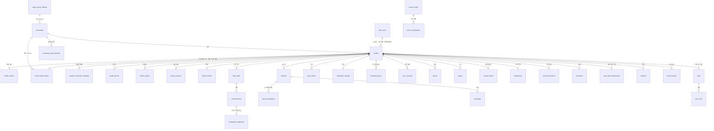
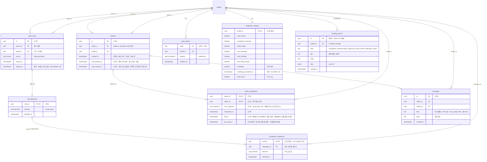
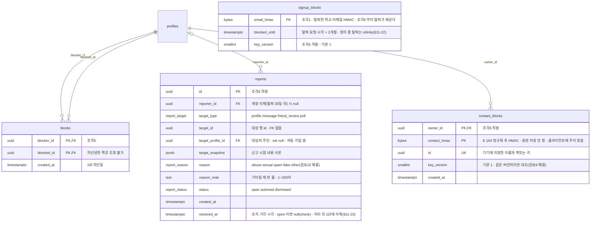
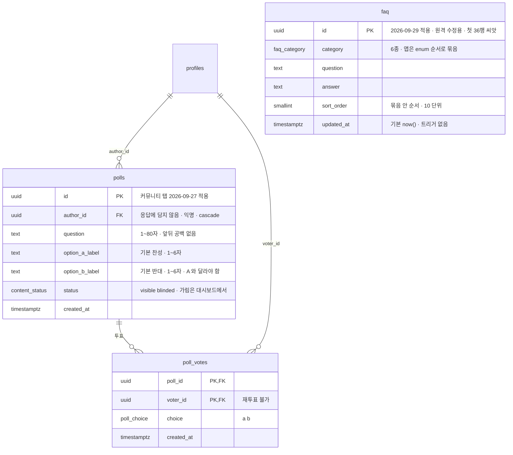

# CampusMate DB ERD

> **상태: 초안 v3 (2026-09-13 ~ 09-14) · 2차 검수 반려 반영 · 최종 검토 반영 · 탈퇴 정책 결정 반영 · 조각 0·조각 1(1a·1b) Supabase 적용 완료(1a·1b 는 2026-09-20, MCP `apply_migration`).** 조각 0 은 `supabase/migrations/` 4개 + `seed.sql` 로 적용됐다. 조각 1(1a 이메일 인증 훅·1b 학생증 인증)은 마이그레이션 11개(학생증 사진 삭제 트리거였던 `20260919181357` 은 클라우드에 올린 적 없이 폐기·삭제, PR #43)와 `supabase/tests/rls_slice1_test.sql` 을 클라우드에 적용했다(자세한 상태는 `docs/SUPABASE.md` §1). 조각 2 이후는 파일 없음. **PR #99(`20260924163241`, 2026-09-25) 로 `profile_avatars.storage_path` not null 해제 + check 추가 적용됨** — 자세한 상태는 `docs/SUPABASE.md` §1.
> 근거: 설계 문서 `docs/superpowers/specs/2026-09-05-campusmate-foundation-design.md` (§2·§5·§6·§7·§13), `frontend/docs/DESIGN.md` (§5.2·§8·§9), 2026-09-13 ~ 09-14 사용자 결정(§11).
> **2026-09-29 문서 정리 갱신.** 조각 6(신고 · 차단 · 지인 차단 · 탈퇴) · 커뮤니티 · 추천 · 무료 하트 인증 · 지인 리뷰 · 코호트 · 가입 동의 · FAQ 까지 저장소 `supabase/migrations/` 가 **52개**이고, 운영(Supabase)에는 마지막으로 `create_faq`(운영 기록 `20260929054505`)와 그 앞 `create_user_consents`(`20260929051356`)가 적용됐다(대장 전달 값 — 이 문서 담당이 클라우드를 조회하지 않았다). 아래 각 표의 "조각N 제안" 표시는 만들 때의 기록이고, 실제로 만든 칸은 이번 정리에서 "적용됨" 으로 바꿨다.
> **2026-10-09 갱신(소셜 로그인 전환).** 저장소 `supabase/migrations/` 가 **61개**다. 마지막 네 파일 `20261008010000`(학교 없는 pending 프로필) · `20261008020000`(소셜 이름 지우기 트리거) · `20261008030000`(`school_email_claims` · 정리 · 인증 완료 함수) · `20261008040000`(이메일 해시 없는 탈퇴)이 **2026-10-09 운영에 적용됐다**(대장 전달 값 — 이 문서 담당이 클라우드를 조회하지 않았다). 반영 위치: §1 조감도 · §2 표 · §3 `profiles` · `school_email_claims` · 트리거 · 함수, §5 `withdraw_account`. **데이터 이전**: 기존 사용자 25명(대장 전달 값)은 `school_email_verified_at` = 가입 시각(`created_at`, `20261008010000` 의 update)으로, `school_email_claims` 는 `provider = 'email'` 로 채웠다(`backend/scripts/backfill_school_email_claims.py` — HMAC 키가 서버에만 있어 SQL 로 못 채운다).

## 읽는 법

- 컬럼 주석 맨 앞의 **`조각N`** = 그 컬럼·테이블을 추가하는 조각. 조각을 시작할 때 추가한다(설계 §5.4)
- **`제안`** = 스펙에 없어서 이 ERD가 제안하는 것
- **`검토N`** = 아직 정해지지 않은 것. 번호는 §12 "남은 검토"
- **`민감`** = 남에게 가는 응답에 절대 담지 않는 값(설계 §7.1). 민감 값은 `profile_private` 에만 둔다
- 컬럼 없이 계산하는 값: 가입 나이 자격(Asia/Seoul 기준 올해 − `birth_year` ≥ 19, FastAPI 검사), 신뢰 확인 기한(`matches.created_at` + 48시간), 안 읽은 메시지 수(상대가 보낸 메시지 중 `created_at` > 내 `match_participants.last_read_at`), 아바타 교체 무료 여부(`profile_avatars` 성공 건수), 주기당 추가 카드 1장(`daily_cards.source`), 월간 추천 랭킹(`referrals` 집계, 탈퇴자 제외 §3. 계정 삭제 cascade 로 지난달 행이 줄 수 있어 월말에 순위를 확정해 지급한다 — 조각 7)

## 1. 조감도

```mermaid
%%{init: {'er': {'diagramPadding': 40, 'entityPadding': 25}}}%%
erDiagram
    auth_users ||--o| profiles : "id 공유 · 가입 도중 이탈하면 없음"
    universities ||--o{ university_email_domains : "메일 도메인"
    universities ||--o{ profiles : "소속"
    region_group_settings ||..o{ universities : "region_group"
    profiles ||--o| profile_private : "민감 정보"
    profiles ||--o| school_email_claims : "학교 메일 1개 · 인증 전이면 없음"
    universities ||--o{ school_email_claims : "학교 · restrict"
    profiles ||--o{ student_verification_attempts : "학생증 제출"
    profiles ||--o{ profile_photos : "실사진"
    profiles ||--o{ profile_avatars : "아바타"
    profiles ||--o{ survey_answers : "설문 원본"
    profiles ||--o| profile_vectors : "벡터"
    profiles ||--o{ daily_cards : "받은 카드"
    daily_cards ||--o| card_decisions : "결정"
    card_decisions ||--o| acceptance_responses : "받은 수락함 응답"
    profiles ||--o{ matches : "당사자"
    matches ||--|{ match_participants : "당사자별 상태"
    matches ||--o{ messages : "대화"
    profiles ||--o{ push_tokens : "기기"
    profiles ||--o| notification_settings : "알림"
    profiles ||--o{ pending_pushes : "밤 알림 보류"
    profiles ||--o{ user_consents : "가입 동의"
    profiles ||--o{ blocks : "차단"
    profiles |o--o{ reports : "신고"
    profiles ||--o{ contact_blocks : "연락처 차단"
    profiles ||--o| entitlements : "하트 잔액"
    profiles ||--o{ heart_transactions : "하트 원장"
    profiles |o--o{ purchases : "결제"
    profiles ||--o{ heart_task_submissions : "무료 하트 인증"
    promo_codes ||--o{ promo_redemptions : "코드 사용"
    profiles ||--o{ referrals : "추천"
    profiles ||--o{ friend_reviews : "지인 리뷰"
    profiles ||--o{ polls : "커뮤니티 질문"
    polls ||--o{ poll_votes : "투표"
```

관계가 없는 독립 테이블: `signup_blocks`(탈퇴 후 재가입 제한), `faq`(자주 묻는 질문, 2026-09-29 적용).

## 2. 접근 경로와 RLS

**원칙 (2026-09-13 사용자 결정, §11-8)**

- **쓰기는 전부 FastAPI** 가 검증한 뒤 `service_role` 로 한다. 클라이언트(`authenticated`)에는 INSERT·UPDATE·DELETE 정책을 하나도 두지 않는다. 사용자가 API를 직접 호출해 자기 `status`·`university_id`·인증 상태를 바꾸는 우회가 여기서 막힌다(설계 §7.3·§7.6)
- **클라이언트가 직접 읽는 건 본인 데이터뿐이다.** 정책은 `to authenticated using ((select auth.uid()) = <본인 컬럼>)` 꼴
- **남의 데이터는 FastAPI가 필요한 컬럼만 골라 준다** — 카드 속 상대, 받은 수락함, 매칭 상대의 사진·카카오톡 아이디, 투표 집계, 지인 리뷰. `security definer` 함수는 쓰지 않는다(frontend/CLAUDE.md §10.1)
- **RLS는 컬럼을 가리지 못한다.** 두 사람이 같은 행을 읽는 테이블에는 둘 다 알아도 되는 값만 둔다(`matches` ↔ `match_participants`). 본인 행 안에서도 내려보내지 않을 컬럼은 컬럼 단위 grant 로 뺀다
- **탈퇴 삭제 규칙(§11-11 · §11-15).** 탈퇴하면 FastAPI 가 계정을 `withdrawn` 으로 바꾸고 30일 뒤 `auth.users` 를 지운다. 아래 FK 규칙은 그 삭제 때 적용된다. `profiles` 를 가리키는 FK 와, 탈퇴로 지워지는 행을 가리키는 하위 FK(`card_decisions.card_id` · `acceptance_responses.card_id` · `match_participants.match_id` · `messages.match_id` · `poll_votes.poll_id`)는 `on delete cascade` 다. 하나라도 기본값(no action)으로 두면 `auth.users` 삭제가 23503 으로 실패해 탈퇴가 막힌다. 예외는 `reports.reporter_id`(set null, 신고 근거 보존), `profile_avatars.source_photo_id`(set null, §3), `purchases.profile_id`(set null, 결제 내역 5년 보관, §11-14)다. `profiles` 행은 `auth.users` 를 따라 cascade 로 지워진다
- **grant 도 이 표를 따르고, RLS 와 같은 마이그레이션에 둔다.** 새 테이블에 `anon`·`authenticated` 권한이 자동으로 붙는지는 프로젝트 설정에 따라 달라서 믿지 않는다(Supabase 문서 Securing your API). 테이블마다 `revoke all ... from anon, authenticated, service_role` 뒤에 필요한 것만 준다. `service_role` 까지 revoke 해야 자동 grant 유무(프로젝트 설정·적용 시점)와 상관없이 결과가 같다
  - `service_role`: 전 테이블 `select` · `insert` · `update` · `delete`
  - `authenticated`: 아래 표에서 읽기가 있는 테이블만 `select`
  - `anon`: `universities` · `university_email_domains` 만 `select`
  - `anon` · `authenticated` 에는 `insert` · `update` · `delete` 를 주지 않는다. 클라이언트 쓰기는 정책이 아니라 권한에서 막혀 오류(42501)로 끝난다

| 테이블 | 클라이언트 읽기 | 비고 |
| --- | --- | --- |
| `universities` · `university_email_domains` | `anon` · `authenticated` 전체 | 가입 화면의 학교·도메인 확인 |
| `region_group_settings` | `authenticated` 전체 | 다음 지급 시각 표시 |
| `profiles` | 본인 행 (`id`) | |
| `profile_private` | 본인 행 (`profile_id`) · 컬럼 grant `profile_id` · `real_name` 만 | 16e 본인 실명 조회. 번호 암호문·`phone_hmac`·카카오톡 아이디는 내려가지 않는다. 앱은 `select *` 대신 컬럼을 지정한다. 본인 `kakao_id`(16e · 14f · 16e-1)는 FastAPI 가 내려준다(§11-20). **2026-09-28 개정: 16e 는 실명도 서버 `GET /account` 로 받는다**(실명 · 출생연도 · 학교 · 가입일 · 카톡을 한 번에, 계획서 `2026-09-27-account-logout.md` T2). 컬럼 grant 는 남아 있지만 지금 앱은 이 표를 직접 읽지 않는다 |
| `student_verification_attempts` | 없음 | FastAPI 전용 — 본인 반려 사유는 FastAPI 응답으로 내려주고, 재시도 횟수는 행 수로 FastAPI 가 센다(§12-4) |
| `profile_photos` · `profile_avatars` · `survey_answers` | 본인 행 (`profile_id`) | |
| `profile_vectors` | 없음 | FastAPI 전용 |
| `daily_cards` · `card_decisions` · `acceptance_responses` | 없음 | FastAPI 전용 — 카드 화면에는 상대 정보가 섞인다 |
| `matches` | 당사자 (`profile_a` · `profile_b`) | 둘 다 알아도 되는 값만 있다 |
| `match_participants` | 본인 행 (`profile_id`) | 이 테이블로는 상대 행을 못 읽는다. 상대의 수락·나가기는 `messages` 의 시스템 줄로 전해진다(§4) |
| `messages` | 참여 중인 매칭의 메시지 | `exists (select 1 from match_participants mp where mp.match_id = messages.match_id and mp.profile_id = (select auth.uid()) and mp.left_at is null)` |
| `push_tokens` | 없음 | FastAPI 전용 |
| `notification_settings` | 본인 행 | |
| `pending_pushes` | 없음 | FastAPI 전용. **`service_role` 도 `select` · `insert` · `delete` 만** — 보류한 알림은 보내고 지울 뿐 고치지 않는다(§4) |
| `user_consents` | 없음 | FastAPI 전용. **`service_role` 도 `select` · `insert` 만** — 동의 기록은 고치지 않는다(위 "전 테이블" 규칙의 예외). 동의 여부는 `/me/verification-status` 의 `consent` 가 내려준다 |
| `blocks` · `reports` | 없음 | FastAPI 전용 — 차단 목록(16f)은 상대 닉네임이 필요하다. 신고자에게도 신고 목록을 주지 않는다 |
| `contact_blocks` | 본인 행 (`owner_id`) · 컬럼 grant `id` · `owner_id` · `created_at` 만 | 16b 목록. `contact_hmac` 은 내려가지 않는다. **2026-09-27 구현 개정: 클라이언트 권한 0**(정책 없음, `authenticated` grant 없음). 16b 목록은 FastAPI `GET /contact-blocks` 가 준다 |
| `entitlements` · `heart_transactions` · `purchases` · `heart_task_submissions` | 본인 행 | 잔액·내역·인증 상태. `heart_task_submissions` 는 2026-09-28 적용 — 본인 행 `select` 정책 하나, 18a 상태는 서버가 DB 함수로 계산해 준다 |
| `referrals` · `friend_reviews` | 없음 | FastAPI 전용(둘 다 2026-09-28 적용, 정책 0 · `service_role` 만 네 권한) |
| `polls` · `poll_votes` | 없음 | FastAPI 전용 — `author_id` 를 열면 익명이 깨지고(DESIGN §8.11), `poll_votes` 는 본인 행만 열면 집계가 안 되고 다 열면 누가 뭘 골랐는지 보인다 |
| `faq` | `authenticated` 전체 | 2026-09-29 적용. 앱이 supabase-flutter 로 바로 읽는다(공개 참조 표 — ERD_DECISIONS 8 의 예외). `authenticated` = `select` 만, `anon` 없음, `service_role` = 네 권한(문구는 대시보드에서 고친다). 첫 문구 36행은 마이그레이션 안 insert(묶음별 7 · 5 · 6 · 4 · 6 · 8) |
| `signup_blocks` · `promo_codes` · `promo_redemptions` | 없음 | 서버 전용 |
| `school_email_claims` | 없음 | FastAPI 전용(2026-10-09 운영 적용). RLS 켬 · 정책 0 — 본인 행도 못 읽는다(`signup_blocks` 와 같다). `service_role` 만 네 권한. 인증 여부는 FastAPI 가 내려준다(§3) |

사이클 B pgTAP 기대값의 기준:

- 읽기가 있는 테이블: 남의 행 0행. `match_participants` 는 같은 매칭 상대의 행도 0행, `messages` 는 비당사자와 `left_at` 이 찍힌 본인 모두 0행
- 읽기가 없는 테이블(FastAPI · 서버 전용): 본인 행이라도 `select` 가 42501
- 컬럼 grant 테이블: `profile_private` 에서 본인 `select real_name` 은 1행, `select *` 는 42501(조각 1). 본인 `select kakao_id` 도 42501(§11-20)
- 모든 테이블: `anon` · `authenticated` 의 INSERT · UPDATE · DELETE 가 42501
- `anon` 은 `universities` · `university_email_domains` 읽기만 된다
- `profiles` 제약: 온보딩 컬럼 없는 `pending` 행 insert 는 성공, 필수값 없이 `active` 로 바꾸면 check 위반, 대소문자만 다른 닉네임은 unique 위반(§3)
- `service_role` 은 테이블마다 `select` · `insert` · `update` · `delete` 가 모두 있다. 하나라도 빠지면 FastAPI 쓰기가 깨진다. 예외: `user_consents` 는 `select` · `insert` 만(동의 기록은 고치지 않는다, 위 표)
- `public` 시퀀스에는 `anon` · `authenticated` · `service_role` 권한이 하나도 없다(0행). identity 컬럼은 테이블 `insert` 권한만으로 번호를 받는다(조각 1 `student_verification_attempts_id_seq`)
- `profile-photos` · `student-id-temp` 버킷은 비공개이고 `storage.objects` 에는 정책이 없다(§9). 두 버킷 모두 10MB · `image/jpeg` · `image/png` 제한이 걸린다(조각 1)
- 계정 삭제 cascade(탈퇴 30일 뒤, §11-15): `auth.users` 행을 지우면 `profiles` · `profile_photos` · `profile_private` · `student_verification_attempts` 행이 함께 지워진다

## 3. 계정 · 프로필 (조각 0~3)

```mermaid
%%{init: {'er': {'diagramPadding': 40, 'entityPadding': 25}}}%%
erDiagram
    auth_users ||--o| profiles : "id 공유 · 가입 도중 이탈하면 없음"
    universities ||--o{ university_email_domains : "학교당 여러 개"
    universities ||--o{ profiles : "소속"
    region_group_settings ||..o{ universities : "region_group"
    profiles ||--o| profile_private : "민감 정보"
    profiles ||--o| school_email_claims : "학교 메일 인증 1회"
    universities ||--o{ school_email_claims : "on delete restrict"
    profiles ||--o{ student_verification_attempts : "학생증 제출 한 번에 한 행"
    profiles ||--o{ user_consents : "항목 × 판마다 한 행"
    profiles ||--o{ profile_photos : "실사진 2~4장"
    profiles ||--o{ profile_avatars : "생성 이력"
    profile_photos |o--o{ profile_avatars : "원본 사진"
    profiles ||--o{ survey_answers : "9축"
    profiles ||--o| profile_vectors : "1행"

    universities {
        uuid id PK "조각0"
        text name UK "조각0"
        text region_group "조각0 · 첫 출시 seoul"
        timestamptz card_opens_at "코호트 2026-09-28 적용 · null=이미 열림 · 월요일 07:00 Asia/Seoul 만(check)"
        timestamptz created_at "조각0"
    }

    university_email_domains {
        text domain PK "조각0 · 학생인증 화이트리스트 · 소문자"
        uuid university_id FK "조각0"
    }

    region_group_settings {
        text region_group PK "조각4 · 가칭"
        smallint[] issue_weekdays "지급 요일 · 배치가 사다리로 덮는 결과값 · 기본 월(1) · 2026-10-03 5단계(ladder.py)"
        integer ladder_twice_per_week_min "남녀 중 적은 쪽 활성 인원 이 값 이상 주 2회(월목) · 기본 50 · 미만은 주 1회(월)"
        integer ladder_three_per_week_min "주 3회(월수금) · 기본 500"
        integer ladder_four_per_week_min "주 4회(월수금일) · 기본 1000"
        integer ladder_daily_min "매일 · 기본 2000 · 넷은 오름차순 check"
        time issue_time "07:00 · Asia/Seoul"
        timestamptz updated_at
    }

    profiles {
        uuid id PK, FK "조각0 · auth.users.id"
        uuid university_id FK "조각0 · 2026-10-09 null 허용 · 학교 메일 인증(complete_school_email_verification)이 정함 · null=인증 전"
        text nickname UK "조각0 · lower 유니크 · 한글영문 2~5자"
        gender gender "조각0 · 하드 필터"
        smallint birth_year "조각0 · 연 나이 19세 이상"
        smallint height_cm "조각0 · 필수 · 공개"
        smallint preferred_height_min "조각0 · null이면 상관없음"
        smallint preferred_height_max "조각0"
        text bio "조각0 · self_embedding 원본"
        text mbti "조각0 · null이면 모름"
        jsonb preferred_mbti_flags "조각0 · 8극 토글"
        text major "조각0 · 표시만 · 조각1b부터 department 로도 별칭 응답"
        major_field major_field "조각0 · 표시만"
        smallint admission_year "조각0 · 21 입력을 2021로 저장"
        text student_number "조각1b · 자기 입력 · 학생증 대조 없음"
        text[] interest_tags "조각0 · 45개 풀 3~5개"
        profile_status status "조각0 · 기본 pending · withdrawn 은 조각6(적용됨)"
        timestamptz last_active_at "조각0 · 활동성 계수"
        timestamptz created_at "조각0"
        verification_status student_verification "조각1 · 기본 none · FastAPI 만 바꿈"
        timestamptz nickname_changed_at "조각2 · 30일 1회"
        boolean is_smoker "조각2 · 감점 계수"
        religion religion "조각2 · 감점 계수"
        animal_type animal_type "조각2 · 본인 1개"
        impression_type impression_type "조각2 · 본인 1개"
        animal_type[] preferred_animal_types "조각2 · 1~3개 · 필수(2026-09-20 선택→필수)"
        impression_type[] preferred_impression_types "조각2 · 1~3개 · 필수(2026-09-20 선택→필수)"
        text[] my_traits "조각2 · 48개 풀 3~5개"
        text[] ideal_traits "조각2 · 45개 풀 3~5개"
        smallint preferred_age_min "조각2 · null이면 상관없음"
        smallint preferred_age_max "조각2"
        acquisition_channel acquisition_channel "조각2 · 20d 유입경로 · 선택"
        text acquisition_note "조각2 · 기타 한 줄"
        text ideal_note "조각2 · 이런 사람이 좋아요 자유 글 · 필수(2026-09-20 선택→필수) · 빈 문자열=미입력, 매칭 임베딩에서 없음 처리"
        text bio_draft "조각2 · AI 자기소개 초안 저장본 · bio-draft 재호출 시 재생성 대신 이 값 반환"
        timestamptz bio_draft_generated_at "조각2 · 초안 생성 시각 · 1회 제한(설계 §13-71)"
        boolean matching_paused "조각4 · 일시중지 토글"
        timestamptz withdrawn_at "조각6 적용 · 탈퇴 요청 시각 · 30일 뒤 계정 삭제 · status=withdrawn 과 짝(check)"
        timestamptz auto_hidden_at "조각6 적용 · 서로 다른 3명 신고로 자동 가림된 시각 · 카드 · 새 매칭 제외"
        text referral_code UK "추천 2026-09-28 적용 · 대문자 숫자 6자(0 O 1 I 제외) · DB 기본값으로 발급 · not null"
        timestamptz school_email_verified_at "2026-10-09 적용 · 학교 메일 인증 시각 · null=인증 전(14일 뒤 정리 배치) · auth.users.email_confirmed_at 과 다름"
    }

    school_email_claims {
        bytea school_email_hmac PK "2026-10-09 적용 · 학교 메일 HMAC(FastAPI 계산) · 주소는 저장 안 함"
        uuid university_id FK "not null · on delete restrict · 인덱스"
        uuid profile_id FK, UK "not null · 계정당 1개 · on delete cascade"
        text provider "not null · kakao google apple email(check) · email=소셜 전 OTP 가입 기존 계정"
        smallint key_version "not null · 기본 1 · 같은 버전끼리만 대조"
        timestamptz verified_at "not null · 기본 now()"
    }

    profile_private {
        uuid profile_id PK, FK "조각1"
        text real_name "조각1 · 민감 · 3b 입력 · 학생증 이름 대조 · 본인만 16e 조회"
        bytea phone_number "조각2 · 민감 · 04-1 · pgcrypto 암호문(2026-09-29 표기 정정, 종전 text)"
        bytea phone_hmac "조각6 적용 · 민감 · 지인 차단 · 추천 같은 번호 대조 · 유니크 안 검(검토5 해결)"
        smallint phone_hmac_key_version "조각6 적용 · 기본 1 · 같은 버전끼리만 대조"
        text kakao_id "조각2 · 민감 · 04-1b 가입 시 필수 입력(2026-09-14 개정, 종전 조각5 신뢰 확인 시점 수집) · 신뢰 확인 통과 후 상대에게만 · 주인이 withdrawn 이면 상대에게 주지 않음(§3)"
        timestamptz updated_at
    }

    student_verification_attempts {
        bigint id PK "조각1 · identity"
        uuid profile_id FK "조각1 · cascade"
        text file_path "조각1 · student-id-temp 객체 경로"
        verification_status result "조각1 · 기본 pending · none 불가"
        text reject_reason "조각1 · rejected 일 때"
        timestamptz submitted_at "조각1"
        timestamptz reviewed_at "조각1 · 판정 전 null"
    }

    user_consents {
        uuid profile_id PK, FK "가입 동의 2026-09-29 · cascade"
        consent_kind kind PK "terms · privacy 만 받음(09-29)"
        text version PK "YYYY-MM-DD · FastAPI CONSENT_VERSION"
        timestamptz agreed_at "기본 now() · 서버 시각"
    }

    profile_photos {
        uuid id PK "조각0"
        uuid profile_id FK "조각0"
        text storage_path UK "조각0 · profile-photos 비공개 버킷"
        smallint position "조각0 · 0~3 · 최대 4장"
        boolean is_avatar_source "조각2 · 프로필당 1장"
        timestamptz created_at "조각0"
    }

    profile_avatars {
        uuid id PK "조각2 제안"
        uuid profile_id FK
        uuid source_photo_id FK "원본 사진 삭제되면 null"
        text storage_path "변환 결과 · 실패 이력은 null · ready 면 not null(check)"
        avatar_status status "pending ready failed"
        boolean is_fallback "5회 연속 실패 보상으로 넣은 기본 아바타 행이면 true(Part C, 미적용)"
        timestamptz created_at "최신 ready 가 현재 아바타"
    }

    survey_answers {
        uuid profile_id PK, FK "조각2"
        smallint axis PK "1~9 · 2가 낯가림"
        numeric value "5점 · -1 -0.5 0 0.5 1"
        timestamptz answered_at
    }

    profile_vectors {
        uuid profile_id PK, FK "조각3"
        vector(8) self_survey "낯가림 제외 8축 · 가중치 사전 곱셈 · L2"
        numeric shyness_score "낯가림 원값 · 5점"
        vector(512) self_embedding "나는 문장 임베딩 · 학과계열+MBTI+얼굴상인상+자기소개 · 코사인"
        vector(512) want_embedding "원해 문장 임베딩 · 선호얼굴상인상+이런사람이좋아요 · 코사인"
        timestamptz updated_at
    }
```

- `profiles` 폐기 컬럼 — 만들지 않는다: `hide_same_major`(설계 미결27), `ideal_description`(설계 미결33). `looking_for`는 조각0에 만들었다가 "찾는 성별" 폐지(반대 성별 자동 매칭, 2026-09-14 사용자 결정)로 조각2 마이그레이션에서 지웠다 — 조각0 마이그레이션 파일은 고치지 않았다(§12-36 완료)
- `profiles` 행은 FastAPI가 아니라 **`auth.users` INSERT 후 Postgres 트리거(`handle_new_user_profile`)**가 만든다(2026-09-18, FK 순서 문제로 정정 — §11-26). Before User Created 훅 시점엔 `auth.users` 행이 아직 커밋 전이라 거기서 `profiles` insert 를 하면 FK 위반이 난다. 3b의 `profile_private` 가 이 행을 FK로 가리키므로 먼저 있어야 한다. 클라이언트 INSERT는 없다(§2)
  - **2026-10-09 개정(`20261008010000` ⑤)**: 트리거는 **학교를 정하지 않는다.** `raw_app_meta_data.provider = 'email'` 인 계정(학교 메일 인증번호를 받으려고 앱이 잠깐 만드는 임시 계정)은 **프로필을 만들지 않고**, 그 밖의 계정(카카오 · 구글 · 애플, provider 없는 행 포함)은 `insert into profiles (id)` 로 **학교 없는 `pending` 프로필**만 만든다. 학교는 아래 `complete_school_email_verification` 한 길로만 정한다(학교 도메인 구글 계정에 여기서 학교를 채우면 `school_email_claims` 에 메일이 안 남아 "학교 메일 1개 = 계정 1개" 가 깨진다)
- **이 시점에 정해지는 `university_id`(메일 도메인으로) · `status`(`pending`)만 `not null` 이다.** **2026-10-09 개정: `university_id` 도 null 허용이다**(`20261008010000` ①) — 학교 메일 인증 전에는 비어 있고, 이 칸을 읽는 SQL(`match_candidates` · `card_issue_owners` · `region_active_counts` · `home_stats`)은 inner join · `=` 비교라 인증 전 사람은 후보 · 카드 · 사다리 인원 · 학교 목록에서 빠진다. 지금 트리거가 정하는 `not null` 값은 `status`(`pending`)뿐이다. 온보딩(DESIGN 04-1 이후)에서 받는 `nickname` · `gender` · `birth_year` · `height_cm` 는 null 허용이고, 아래 check 로 필수값 없는 `active` 전환을 막는다. 조각 0 계획서 초안처럼 온보딩 컬럼을 `not null` 로 두면 FastAPI insert가 실패한다. **`looking_for` 는 이 check 에서도 조각2 마이그레이션 때 함께 빠졌다**(§12-36)
  `check (status <> 'active' or (nickname is not null and gender is not null and birth_year is not null and height_cm is not null))`
- 가입 나이의 "올해"는 Asia/Seoul 기준이다(UTC 12월 31일 15:00 경계). check 에 `now()` 를 넣지 않고 FastAPI가 검사한다. DB에는 `now()` 없는 정적 범위 check만 둔다
- `profiles` 정적 check(조각 0): `nickname` 한글·영문 2~5자, `birth_year` 1950~2020, `height_cm` 120~230, `preferred_height_min` · `max` 도 120~230 이고 min ≤ max, `admission_year` 1950~2100(두 자리 입력을 그대로 저장하는 실수 방지), `mbti` `^[EI][NS][TF][JP]$`, `preferred_mbti_flags` 는 JSON 객체(키 E I N S T F J P, 값 boolean · true 가 ok, 설계 §6.4 — 기본 `{}` 는 전부 ok 와 같은 결과), `interest_tags` 5개 이하(하한 3개는 FastAPI 온보딩 완료 검사)
- 선호 키·나이 슬라이더(DESIGN `range-slider` 프리셋)의 끝 표기 "150cm 이하" · "190cm 이상" · "35세 이상"은 그쪽 경계를 null 로 저장한다. 끝값 150 을 그대로 저장하면 145cm 상대가 빠진다
- `profiles.university_id` 는 `on delete restrict` — 프로필이 남아 있는 대학은 지울 수 없다. `university_email_domains` 는 대학을 따라 cascade 로 지워진다
- `universities.name` 은 unique 다(시드가 이름으로 도메인을 짝짓는다). `university_email_domains.domain` 은 소문자 도메인 형식 check `^[a-z0-9-]+(\.[a-z0-9-]+)+$`. 도메인 1개는 대학 1개에만 속하고, 서울 밖 캠퍼스도 따로 나누지 않는다(§11-10)
- 조각 4에서 `universities.region_group` 에 `region_group_settings` FK 를 걸 때는 같은 마이그레이션에서 `seoul` 행을 먼저 넣는다
- 민감 값(`real_name` · `phone_number` · `phone_hmac` · `kakao_id`)은 `profile_private` 로 분리했다. 서버 코드가 남의 프로필을 `select *` 로 읽어도 민감 값이 딸려 나오지 않는다. 접근 감사 로그는 테이블 없이 FastAPI 구조화 로그로 남긴다(§11-13). 운영자도 FastAPI 관리 기능으로만 조회하고 Supabase 대시보드·SQL 로 직접 보지 않는다(§11-18)
- `student_verification` 은 boolean이 아니라 상태값(`none` `pending` `verified` `rejected`, 2026-09-14 확정)이다. 3b의 "조금 더 확인이 필요해요" 대기 상태를 담아야 하기 때문이다
- `student_verification_attempts` 는 학생증 제출 한 번에 한 행이다(§12-4, 2026-09-14 사용자 결정). 재시도 횟수(설계 미결3)는 이 테이블의 행 수로 FastAPI 가 세고, 반려 사유(`reject_reason`)는 본인에게 FastAPI 응답으로 내려준다. `result` 는 제출 직후 `pending` 이고 `none` 일 수 없다(check). 클라이언트 권한은 없다(§2). **`verified` 확정 후 재제출은 FastAPI 가 막는다(409, 2026-09-20 결정)** — `rejected` 는 계속 재제출 가능
- **`profiles.department` 컬럼은 만들지 않는다(2026-09-20 결정)** — 학과는 기존 `major` 컬럼을 재사용하고, FastAPI 응답에서만 `department` 로 별칭한다. 학번은 `student_number` 컬럼을 새로 추가했다(설계 §7.3, 마이그레이션 `20260919181319`)
- **`profiles.bio_draft` · `bio_draft_generated_at`**: AI 자기소개 초안은 최초 1회만 생성한다. `bio_draft_generated_at` 이 이미 있으면 재호출 시 재생성하지 않고 저장된 `bio_draft` 값을 그대로 반환한다(설계 §13-71)
- **`profiles.ideal_note`**: 빈 문자열이면 "미입력"으로 취급한다. 매칭 임베딩("원해" 문장, 설계 §6.3) 계산에서는 빈 문자열을 "없음"으로 처리한다
- `profile_photos` 장수 2~4장: 상한은 `position` 범위로, 하한은 FastAPI 온보딩 완료 검사로 막는다
- `profile_photos` 는 `unique (profile_id, position) deferrable initially deferred` — 순서를 맞바꿀 때 중간 충돌을 피한다. `storage_path` 는 unique — 두 행이 같은 파일을 가리키면 한 행을 지울 때 남은 행의 사진도 사라진다
- `profile_photos.is_avatar_source` 는 부분 유니크 인덱스 `(profile_id) where is_avatar_source` 로 1장만 허용
- **아바타 원본으로 고른 사진도 신뢰 확인을 통과하면 다른 실사진과 함께 공개한다**(§11-5). 어느 사진이 원본인지는 상대에게 드러내지 않는다
- `profile_avatars.storage_path` 는 null 허용이고 경로가 진짜로 필요한 행만 `check (status <> 'ready' or storage_path is not null)` 으로 묶는다(마이그레이션 `20260924163241`, 2026-09-25 사용자 결정 A). 생성 실패 행에는 저장할 경로가 없는데 not null 이라 실패 이력이 한 줄도 안 쌓였고, 그래서 "5회 연속 실패 → 기본 아바타 + 하트 10" 이 걸리지 않았다(운영 00018-pxb). 읽는 쪽은 예전부터 `status = ready` 행만 골라 쓰므로(카드·채팅의 아바타 URL) 경로가 null 인 행이 화면으로 새지 않는다
- **(미적용, Part C)** `profile_avatars_one_pending` 부분 유니크 인덱스 `(profile_id) where status = 'pending'` — 한 사람에게 `pending` 행은 한 줄만 허용해 중복 누름·워커 재시도가 겹쳐도 두 번째 insert 가 23505 로 튕긴다. `is_fallback` 은 5회 연속 실패 보상 행을 정상 생성 결과와 구분해 결과 화면 안내를 고른다. 클라우드 적용은 사용자 승인 대기 중(계획서 2026-09-25-avatar-async-cloud-tasks.md Part C)
- `profile_vectors` 는 벡터 2종(§6.3)을 한 행에 둔다(1:1)
- 벡터 확장(`vector`)은 조각 0 첫 마이그레이션에서 `extensions` 스키마에 켰다. 조각 3에서 벡터 컬럼을 만들 때는 타입을 `extensions.vector` 로 쓰거나 `search_path` 에 `extensions` 가 있는지 확인한다
- **탈퇴는 30일 뒤에 지운다(§11-15).** 탈퇴하면 FastAPI 가 `status = withdrawn` · `withdrawn_at` 을 쓰고, 세션을 끊고 다시 로그인하거나 토큰을 갱신하지 못하게 막는다(Supabase Auth ban 전제, 토큰 갱신까지 막히는지는 조각 6에서 확인). 이미 발급된 access token 은 만료(`jwt_expiry`)까지 살아 있어 그동안 RLS 로 본인 행은 읽힌다. 본인 데이터라 RLS 에 status 조건은 넣지 않는다. `withdrawn` 계정의 요청은 FastAPI 가 받지 않는다
  - 즉시 빠지는 곳: `active` 가 아니므로 카드 · 받은 수락함 · 매칭 생성 · 투표 글 · 투표 집계 · 지인 리뷰 노출에서 빠진다. `push_tokens` 는 탈퇴 즉시 지운다
  - 게이트: 상대가 `withdrawn` 이면 게이트를 통과시키지 않는다. 이미 통과한 매칭에서도 탈퇴자의 `kakao_id` 와 실사진 서명 URL 은 더 주지 않는다
  - 남은 상대: 게이트를 통과한 매칭은 30일 동안 채팅을 읽고 신고할 수 있고, 메시지는 보낼 수 없다. 통과하지 않은 매칭은 기존 규칙대로 48시간 기한에 게이트 실패로 채팅이 지워져, 그때까지만 읽기·신고가 된다
  - 추천: 탈퇴자의 `referral_code` 는 받지 않는다(없는 코드로 처리). 피추천인이 학생증을 통과해도 탈퇴한 추천인 몫 50하트는 주지 않고, 월간 추천 랭킹 보상에서도 뺀다
  - 알려진 한계: 30일 동안 탈퇴자의 닉네임(lower unique)과 `referral_code` 는 점유된 채로 남는다
  - 30일 뒤 FastAPI 가 Storage 파일을 지운 뒤 `auth.users` 를 지우고, 나머지 행은 §2 FK 규칙대로 지워진다. 학생증 사진(`student-id-temp`)만 30일을 기다리지 않고 탈퇴 즉시 지우고, `profile_private` 는 30일 보관한다(§11-19). 30일 뒤 삭제는 Auth 관리 API 의 하드 삭제여야 한다. 소프트 삭제(`shouldSoftDelete`)는 `auth.users` 행이 남아 cascade 가 돌지 않는다(조각 6에서 확인). 탈퇴는 되돌릴 수 없다(§11-21)
- 조각 6 마이그레이션: `alter type public.profile_status add value 'withdrawn'` 로 넣은 값은 그 트랜잭션이 커밋된 뒤에야 쓸 수 있다. `withdrawn` 을 쓰는 check(후보 `(status = 'withdrawn') = (withdrawn_at is not null)`)·인덱스는 다음 마이그레이션 파일로 나눈다
- 30일 뒤 `profiles` 가 `on delete cascade` 로 지워져도 Storage 파일은 지워지지 않는다. 사진(`profile-photos`)·아바타(`avatars`)·무료 하트 인증샷(`heart-task-proofs`) 파일 삭제는 FastAPI 몫. 검증이 끝나지 않은 학생증 사진(`student-id-temp`)은 탈퇴 즉시 FastAPI 가 지운다(§11-19)
- **`user_consents`(가입 동의, 2026-09-29 적용 — 운영 기록 `20260929051356`)**: 항목 × 판마다 한 행, PK `(profile_id, kind, version)`, `version` 은 `YYYY-MM-DD` check, `agreed_at` 은 서버 시각. FastAPI 전용이고 **`service_role` 도 `select` · `insert` 만** — 동의 기록은 고치지 않는다(§2 예외). 탈퇴 계정 삭제 때 cascade. **`kind` enum 의 `sensitive_religion` · `overseas_transfer` 값은 남겨 두지만 쓰지 않는다**(2026-09-29 4칸 결정: 필수 = `terms` · `privacy`, 선택 = 마케팅 — 마케팅은 이 표가 아니라 `notification_settings.marketing`). 운영에 적용된 enum 이라 값을 지울 수 없어 남긴다(§8). 종교는 개인정보 수집·이용 동의 안에, OpenAI 국외 이전은 처리방침 공개로 대신한다(설계 §7.8)
- **`universities.card_opens_at`(코호트, 2026-09-28 적용)**: null 이면 이미 열린 학교(지금 학교 전부). 값이 있으면 check `universities_card_opens_monday_0700` 가 **서울 월요일 07:00 · 유한 값**만 받는다. `match_candidates` · `card_issue_owners` · `region_active_counts` 가 "열림 = null 이거나 지남" 조건 한 줄씩을 더했다(시그니처 그대로 `create or replace`). `universities` 는 `anon` 까지 읽기라 여는 시각도 공개된다. 종전 제안 `recruit_starts_at` 은 **만들지 않는다**(학교 행을 넣는 순간이 모집 시작)
- **`profiles.referral_code`(2026-09-28 적용)**: `generate_referral_code()` 기본값 · unique · check `^[A-HJ-NP-Z2-9]{6}$`, 기존 행도 채웠다. 정지 · 탈퇴한 사람의 코드는 없는 코드로 처리한다
- **`profiles.school_email_verified_at`(소셜 로그인, 2026-10-09 운영 적용 — `20261008010000`)**: null = 학교 메일 인증 전. 소셜 가입 때 GoTrue 가 채우는 `auth.users.email_confirmed_at` 은 학교 메일 증거로 쓰지 않고 이 칸만 본다. check **`profiles_verified_requires_university`** `(school_email_verified_at is null or university_id is not null)` — "인증했는데 학교 없음" 반쪽 상태를 막는다. 부분 인덱스 **`idx_profiles_unverified_created_at`** `on profiles (created_at) where school_email_verified_at is null` — 정리 배치가 "인증 전 + 오래된 순" 으로 읽는다. 같은 파일이 기존 행(학교 있는 행)을 `school_email_verified_at = created_at` 으로 채웠다(상태줄 "데이터 이전")
- **`school_email_claims`(학교 메일 1개 = 계정 1개, 2026-10-09 운영 적용 — `20261008030000` ⑦)**: 지금 그 학교 메일을 쓰는 계정. PK `school_email_hmac`(FastAPI 가 계산한 HMAC 만 — DB 에서 계산하면 키가 Postgres 에 들어온다), `university_id` FK `on delete restrict` + 인덱스 `school_email_claims_university_id_index`, `profile_id` **unique** FK `on delete cascade`(인증 뒤 메일 변경 불가), `provider` check `kakao` `google` `apple` `email`(`email` = 소셜 로그인 전에 학교 메일 OTP 로 가입한 기존 계정, 백필 스크립트가 넣는다), `key_version` 기본 1(행마다 키 버전, 대조는 같은 버전끼리), `verified_at` 기본 `now()`. **RLS 켬 · 정책 없음**, `revoke all ... from anon, authenticated, service_role` 뒤 `service_role` 에만 `select` · `insert` · `update` · `delete`. 탈퇴 뒤 재가입 제한은 `signup_blocks` 가 따로 맡는다 — 탈퇴 30일 뒤 `auth.users` 가 지워지면 이 행도 cascade 로 지워져 그 메일을 다시 쓸 수 있다
- **트리거 `scrub_social_identity_names`(2026-10-09 운영 적용 — `20261008020000` ⑥)**: `auth.users`(`before insert or update of raw_user_meta_data`) · `auth.identities`(`before insert or update of identity_data`) 두 곳에 같은 이름으로 건다. 소셜 제공자가 넣는 이름 · 사진을 저장 전에 지운다 — 지울 키가 아니라 **남길 키 6개만** 적는다: `email` · `sub` · `provider_id` · `iss` · `email_verified` · `phone_verified`. 객체가 아닌 값은 건드리지 않는다. 함수는 security invoker, `anon` · `authenticated` 실행 권한 회수. auth 스키마 표에 거는 트리거라 Supabase 업그레이드 뒤 남아 있는지 다시 본다
- **DB 함수(2026-10-09 운영 적용 — `20261008030000`)** — 둘 다 security invoker, `public` · `anon` · `authenticated` 회수, `service_role` 만 실행
  - `list_unverified_accounts(p_older_than_days integer, p_limit integer default 100) returns table (id uuid)` — 학교 메일 인증 전(`school_email_verified_at is null`)이고 `p_older_than_days` 일이 지난 프로필 id 를 오래된 순 `p_limit` 개. 둘 중 하나라도 null 이거나 1 미만이면 22023 오류. 고르기만 하고 지우는 것은 FastAPI 가 auth 관리자 API 로 한다(정리 배치, 14일). email 방식 임시 계정은 프로필이 없어 여기 나오지 않는다
  - `complete_school_email_verification(p_profile uuid, p_email_hmac bytea, p_university uuid, p_provider text, p_key_version smallint default 1) returns text` — claims 기록과 프로필의 학교 · 인증 시각을 한 트랜잭션에 쓴다(프로필 행 `for update` 잠금, 같은 메일 동시 호출은 `on conflict do nothing`). 돌려주는 값: `ok` = 기록함(같은 계정 · 같은 메일로 다시 불러도 `ok`, 멱등) / `kakao` · `google` · `apple` · `email` = 그 메일을 다른 계정이 쓰고 있다, 그 계정의 가입 방식(아무것도 안 바꿈) / `already_verified` = 이 계정은 이미 인증함(인증 시각이 있거나 claims 행이 있음, 인증 뒤 변경 금지) / `no_profile` = 프로필 없음. 가입 방식이 넷 밖이면 23514

## 4. 카드 · 매칭 · 채팅 (조각 4~5)

```mermaid
%%{init: {'er': {'diagramPadding': 40, 'entityPadding': 25}}}%%
erDiagram
    profiles ||--o{ daily_cards : "owner_id"
    profiles ||--o{ daily_cards : "target_id"
    daily_cards ||--o| card_decisions : "결정 1회"
    card_decisions ||--o| acceptance_responses : "accept 일 때 상대 응답"
    profiles ||--o{ acceptance_responses : "responder_id"
    profiles ||--o{ matches : "profile_a"
    profiles ||--o{ matches : "profile_b"
    matches ||--|{ match_participants : "당사자 2행"
    profiles ||--o{ match_participants : "profile_id"
    matches ||--o{ messages : "대화"
    profiles ||--o{ messages : "sender_id"
    profiles ||--o{ push_tokens : "기기"
    profiles ||--o| notification_settings : "16d"
    profiles ||--o{ pending_pushes : "밤 알림 보류"

    daily_cards {
        uuid id PK "조각4"
        uuid owner_id FK "받은 사람"
        uuid target_id FK "카드 속 상대"
        card_source source "daily purchased"
        timestamptz issued_at
        timestamptz expires_at "제안 · daily는 다음 지급 · purchased는 null"
    }

    card_decisions {
        uuid card_id PK, FK "조각4"
        card_decision decision "accept reject"
        timestamptz decided_at
    }

    acceptance_responses {
        uuid card_id PK, FK "조각4 제안 · A가 accept 한 카드"
        uuid responder_id FK "받은 수락함 주인 B"
        card_decision decision "B가 고른 값"
        timestamptz decided_at
    }

    matches {
        uuid id PK "조각4"
        uuid profile_a FK "profile_a 가 profile_b 보다 작다"
        uuid profile_b FK
        timestamptz created_at "게이트 시계 시작 · 기한은 +48시간"
        timestamptz trust_passed_at "조각5 · 양쪽 수락 순간 · 둘 다 아는 사실"
        timestamptz chat_closed_at "조각5 · 기한 도달 시에만 · 한쪽이 나간 방은 안 닫는다"
    }

    match_participants {
        uuid match_id PK, FK "조각4"
        uuid profile_id PK, FK "조각4 · 본인 행만 조회"
        trust_response trust_response "조각5 · accept 또는 null · 거절은 left_at 으로 남는다"
        timestamptz responded_at "조각5"
        timestamptz left_at "조각5 · 채팅방 나가기(게이트 거절 포함) · 상대에게 시스템 줄로 보인다"
        timestamptz last_read_at "조각5 제안 · 방 진입·이탈 때 갱신 · 상대에게 비공개"
    }

    messages {
        uuid id PK "조각5"
        uuid match_id FK
        uuid sender_id FK
        text kind "text 말풍선 · left 나감 · trust_accept 수락 · 기본 text"
        text body "텍스트만"
        timestamptz created_at
    }

    push_tokens {
        text token PK "조각4 · FCM"
        uuid profile_id FK
        device_platform platform "android ios"
        timestamptz updated_at
    }

    notification_settings {
        uuid profile_id PK, FK "조각4 제안"
        boolean card_arrived
        boolean acceptance_received
        boolean match_made
        boolean new_message
        boolean trust_reminder
        boolean new_friend_review
        boolean marketing "기본 false"
        timestamptz marketing_consented_at "제안 · 수신 동의 시각"
        boolean quiet_hours "22시~8시"
    }

    pending_pushes {
        uuid id PK "결정4 · 2026-10-03 제안"
        uuid profile_id FK "on delete cascade"
        text kind "acceptance_received match_made new_friend_review verification_result"
        text title "원래 알림 그대로"
        text body
        jsonb data "route 등"
        timestamptz created_at
    }
```

- `matches` 는 `unique (profile_a, profile_b)` + `check (profile_a < profile_b)`
- **당사자별 값은 `match_participants` 에 둔다.** `matches` 행은 두 사람이 다 읽으므로, 사람마다 다른 값(응답 시각·읽음·나간 시각)을 거기 두면 상대 것까지 딸려 보인다
- **게이트 동작은 전부 상대에게 보인다(2026-09-22 사용자 결정 10·11).** 수락하면 `messages` 에 `kind='trust_accept'` 시스템 줄이, 나가면 `kind='left'` 시스템 줄이 남는다. 거절은 따로 저장하지 않는다 — **거절은 곧 채팅방 나가기**라서 `trust_response` 에는 `accept` 아니면 null 만 들어간다. 수락은 매칭 순간부터 할 수 있고 양쪽이 수락하면 48시간 전이라도 그 자리에서 공개된다
- 게이트 판정(설계 §2.5): 기한(`created_at` + 48시간) 전에 양쪽이 accept → FastAPI가 `trust_passed_at` 기록 + 카카오톡 아이디 공유 + 실사진 공개. 기한까지 `trust_passed_at` 이 없으면 그때 `chat_closed_at` 을 기록하고 채팅을 닫는다
- **`chat_closed_at` 은 기한이 됐을 때만 기록한다.** 단 **한쪽이라도 나간 매칭은 아예 닫지 않는다** — 닫을 사람이 없는데 닫으면 남은 사람의 지난 대화만 목록에서 사라진다. 닫는다는 것은 이 칸 하나를 찍는 것뿐이고 메시지는 지우지 않는다(조각 7 "잠긴 방"이 다시 쓴다)
- 채팅방의 "신뢰 확인 완료" 카드(`trust-reveal-bubble`)는 메시지 행이 아니라 `matches.trust_passed_at` 으로 그린다
- **읽음은 메시지가 아니라 `match_participants.last_read_at` 에 둔다.** `messages.read_at` 은 두 사람이 다 읽으므로, 상대가 조용히 나가면 내 메시지가 계속 안 읽힘으로 남아 나가기가 드러난다. 안 읽은 수는 상대가 보낸 메시지 중 `created_at` > 내 `last_read_at` 이고, 갱신은 메시지마다가 아니라 방에 들어올 때와 나갈 때 한 번씩이다(나갈 때도 갱신해야 방 안에서 받은 메시지가 안 읽음으로 남지 않는다). 상대에게 보이는 읽음 표시는 없다
- 수락이 겹치는 경로 두 가지: A의 카드에서 A accept → B가 받은 수락함에서 응답(`acceptance_responses`), 또는 서로의 카드에서 둘 다 accept. 어느 쪽이든 양쪽 accept 가 되면 FastAPI가 `matches` 와 `match_participants` 2행을 만든다
- **하드 필터 "이미 카드로 받은 사람"의 정의(§11-4, 설계 §6.7)**: 내가 결정한 카드의 상대(`card_decisions`) + 받은 수락함에서 응답한 상대(`acceptance_responses`) + 매칭 이력이 있는 상대(`matches`, 게이트 실패 포함) + 아직 만료되지 않은 카드의 상대. **무응답으로 만료된 무상 카드의 상대는 다시 나올 수 있다.** **실제 동작(2026-09-21 사용자 확정, `20260928050000` `match_candidates`)은 영구 제외가 아니라 쉬는 기간이다**: 결정한 카드의 상대는 결정 후 90일, 무응답 만료 카드의 상대는 만료 후 14일, 내가 수락 응답을 한 상대도 90일 쉬고, **매칭된 상대만 영구 제외**다. 그래서 `daily_cards (owner_id, target_id)` 는 unique가 아니라 일반 인덱스다
- **`pending_pushes`(밤 알림 보류, 결정 4 · 2026-10-01 사용자 — 2026-10-03 제안, 운영 미적용)**: 조용한 시간(22~08시)에 걸린 받은 수락 · 매칭 · 지인 리뷰 · 학생증 검토 결과(A7) 알림을 버리지 않고 원래 제목 · 본문 · `data` 그대로 한 행씩 넣는다(`app/cards/push.py` `notify`). 매시 chat-gate 배치가 조용하지 않은 시각(08~21시)에 돌면 사람 × 가는 화면(`data.route`)으로 묶어 보내고 지운다 — 1건이면 원래 알림, 여러 건이면 "밤사이 2명이 나를 수락했어요" 식 묶음. 친구 가입(리뷰 쓰기) · 학생증 검토 결과 알림은 묶지 않고 한 건씩 보낸다. **내가 방금 한 행동으로 생긴 내 쪽 알림은 보류하지 않고 버린다**(대장 10-03) — 밤에 내가 눌러 생긴 매칭의 내 쪽 "매칭됐어요!", 마지막에 누른 사람 쪽 "카카오톡 아이디를 주고받았어요"(둘 다 방금 화면에서 봤다, `notify(defer=False)`). 보낼 때 `notify` 를 다시 지나서 밤사이 끈 알림 · 정지 · 탈퇴는 걸린다. 채팅 · 카드 도착은 조용한 시간 예외라, 신뢰 확인 리마인드는 보낼 시각을 08시로 미뤄 둬서 이 표에 오지 않는다. `kind` 는 enum 이 아니라 4값 check 다
- 알림 토글은 지금 7개다. DESIGN 16d의 "내 글의 새 댓글"은 이번 스코프에 커뮤니티 댓글이 없어서(DESIGN §8.11) 컬럼을 두지 않고, 댓글을 도입할 때 추가한다 — 검토11. DESIGN 16d는 지금 고치지 않는다

## 5. 안전 · 계정 상태 (조각 6)

```mermaid
%%{init: {'er': {'diagramPadding': 40, 'entityPadding': 25}}}%%
erDiagram
    profiles ||--o{ blocks : "blocker_id"
    profiles ||--o{ blocks : "blocked_id"
    profiles |o--o{ reports : "reporter_id"
    profiles ||--o{ contact_blocks : "owner_id"

    blocks {
        uuid blocker_id PK, FK "조각6"
        uuid blocked_id PK, FK "차단당한 쪽은 조회 불가"
        timestamptz created_at "16f 차단일"
    }

    reports {
        uuid id PK "조각6 적용"
        uuid reporter_id FK "계정 삭제(탈퇴 30일 뒤) 시 null"
        report_target target_type "profile message friend_review poll"
        uuid target_id "대상 행 id · FK 없음"
        uuid target_profile_id FK "대상의 주인 · set null · 자동 가림 셈"
        jsonb target_snapshot "신고 시점 내용 사본"
        report_reason reason "abuse sexual spam fake other(검토10 해결)"
        text reason_note "기타일 때 한 줄 · 1~200자"
        report_status status "open actioned dismissed"
        timestamptz created_at
        timestamptz resolved_at "조치·기각 시각 · open 이면 null(check) · 처리 뒤 1년에 삭제(§11-23)"
    }

    contact_blocks {
        uuid owner_id PK, FK "조각6 적용"
        bytea contact_hmac PK "E.164 정규화 후 HMAC · 원본 저장 안 함 · 클라이언트에 주지 않음"
        uuid id UK "기기에 저장한 이름과 짝짓는 키"
        smallint key_version "기본 1 · 같은 버전끼리만 대조(검토9 해결)"
        timestamptz created_at
    }

    signup_blocks {
        bytea email_hmac PK "조각1 · 탈퇴한 학교 이메일 HMAC · 조각6 부터 탈퇴가 채운다"
        timestamptz blocked_until "탈퇴 요청 시각 + 2개월 · 정지 중 탈퇴는 infinity(§11-22)"
        smallint key_version "조각6 적용 · 기본 1"
    }
```

- 지인 차단 대조: `contact_blocks.contact_hmac` = `profile_private.phone_hmac` (같은 서버 키, 설계 §7.6b). 나중에 가입한 지인도 가입 때 계산한 `phone_hmac` 로 소급 대조한다
- `phone_hmac` 을 미리 계산해 두는 이유: HMAC 키는 FastAPI 환경변수에만 있어서 DB 안 배치 작업(pg_cron)은 번호를 HMAC 으로 바꿀 수 없다
- **16b 목록의 이름·끝 4자리는 서버에 두지 않는다**(§11-9). 8d에서 고를 때 앱이 기기 안에만 저장하고, FastAPI가 등록 응답으로 돌려준 `contact_blocks.id` 를 키로 짝지어 보여준다. `contact_hmac` 을 키로 쓰지 않는 이유: HMAC 키를 교체하면(검토9) 값이 바뀌어 이름이 전부 끊기고, 클라이언트에 HMAC 값을 줄 필요도 없어진다. 앱을 재설치하거나 기기를 바꾸면 이름 없이 "이전에 차단한 연락처"로 보이지만 차단과 해제는 그대로 된다
- **매칭 중 차단은 `matches` 에 기록하지 않는다.** `chat_closed_at` 같은 공유 값으로 처리하면 상대가 차단을 추론한다. 차단한 사람의 `match_participants.left_at` 과 `blocks` 행으로만 처리한다(설계 §7.2 "차단당한 쪽은 알 수 없어야")
- `reports.target_snapshot` — 게이트 실패 채팅 삭제(설계 §2.5)나 탈퇴 30일 뒤 삭제(§11-15)로 신고된 원본이 사라져도 24시간 조치 근거(애플 심사 지침 1.2)가 남아야 한다. `reporter_id` 는 `on delete set null`. 처리가 끝나고(`resolved_at`) 1년 뒤 행째 지운다(§11-23). check 후보 `(status = 'open') = (resolved_at is null)`
- `signup_blocks` 는 탈퇴로 `profiles` 가 지워진 뒤에도 남아야 하므로 관계가 없다. 원본 이메일을 남기지 않으려고 HMAC 으로 제안. 가입 때 FastAPI HTTP Auth Hook 이 메일 도메인 화이트리스트와 함께 이 표를 검사한다(§11-12). 정지 중 탈퇴는 `blocked_until` 을 `infinity` 로 써서 기간 없이 막는다(§11-22). 기한(`blocked_until`)이 지난 행은 FastAPI 배치(신고 1년 삭제와 같은 배치)가 지운다. 남기면 재탈퇴 때 `email_hmac` PK 가 충돌한다
- **조각 6 적용 기록(2026-09-27, 마이그레이션 `20260927010000` ~ `20260927030100`, 운영 적용됨).** ① `reports`: enum `report_reason` 5값, `reason_note`(기타 한 줄, 1~200자), `target_profile_id`(대상의 주인, 자동 가림 셈), unique `reports_once_per_reporter (reporter_id, target_type, target_id)`, check `reports_status_pair`, 인덱스 `target_profile_id` · `created_at`. 하루 10건 상한은 FastAPI 가 센다. **1년 삭제는 `resolved_at` 기준이다** — 2026-09-29 PR #165 로 코드를 바로잡았다(그 전 배치는 `created_at` 기준이라 1년 넘게 열린 신고까지 지웠다). `resolved_at` 인덱스는 아직 없다(백로그). 적용된 마이그레이션 `20260927010200` 33줄 주석의 옛 기준 문장은 파일을 고치지 않는 규칙이라 그대로다 ② `blocks`: PK `(blocker_id, blocked_id)`, 자기 차단 check, `blocked_id` 인덱스. 신고하면 같은 요청 안에서 차단 행도 넣는다(지인 리뷰 신고만 예외) ③ `contact_blocks`: 위 모양 + `contact_hmac` 인덱스, **클라이언트 권한 0**(§2 개정) ④ `profile_private.phone_hmac` · `phone_hmac_key_version` 을 `set_phone_number`(5인자, `20260927030000`)가 번호와 같이 쓴다 — 옛 번호는 백필 스크립트로 한 번 채웠다 ⑤ `withdraw_account()`(`20260927030100`) — 상태 · `withdrawn_at` · `signup_blocks` 를 한 트랜잭션에(정지면 무기한, 아니면 2개월, 두 번 불러도 같다). **2026-10-09 개정(`20261008040000`, 운영 적용)**: `p_email_hmac` 이 null 이면(카카오처럼 메일이 없거나 학교 메일 인증 전에 나가는 계정) 상태 · `withdrawn_at` 만 바꾸고 `signup_blocks` 는 남기지 않는다. 서명 · security invoker · `service_role` 만 실행은 그대로 ⑥ `match_candidates` · `card_issue_owners` 가 차단(양방향) · 자동 가림 · 지인 차단(같은 키 버전) 을 뺀다(`20260927010500`)
- **`profile_private.phone_hmac` 유니크는 걸지 않는다**(2026-09-22 사용자 결정, 검토5 해결) — "한 번호 한 계정" 을 DB 로 강제하지 않는다. 학교 메일이 둘인 사람이 같은 번호로 계정 둘을 굴려 정지 · 재가입 제한을 우회할 수 있는 것은 알려진 한계다. 같은 번호 추천 보상 중복은 `redeem_referral` 이 막는다(§6)

## 6. 하트 · 추천 · 지인 리뷰 (조각 7 전후)

```mermaid
%%{init: {'er': {'diagramPadding': 40, 'entityPadding': 25}}}%%
erDiagram
    profiles ||--o| entitlements : "잔액"
    profiles ||--o{ heart_transactions : "원장"
    profiles |o--o{ purchases : "결제"
    profiles ||--o{ heart_task_submissions : "인증샷"
    profiles ||--o{ promo_redemptions : "사용자"
    promo_codes ||--o{ promo_redemptions : "코드"
    profiles ||--o| referrals : "referee_id 가입당 1회"
    profiles ||--o{ referrals : "referrer_id"
    profiles ||--o{ friend_reviews : "reviewer_id"
    profiles ||--o{ friend_reviews : "reviewee_id"

    entitlements {
        uuid profile_id PK, FK "조각7"
        integer heart_balance "0 이상 · 원장 합계"
        timestamptz updated_at
    }

    heart_transactions {
        uuid id PK "조각7 제안"
        uuid profile_id FK
        integer amount "적립은 양수 · 사용은 음수"
        heart_reason reason "값은 §8 열거형"
        uuid ref_id "원인 행 id · FK 없음"
        timestamptz created_at
    }

    purchases {
        uuid id PK "조각7"
        uuid profile_id FK "계정 삭제(탈퇴 30일 뒤) 시 null · 5년 보관"
        store_platform store "app_store play_store"
        text product_id "50 100 200 400 번들"
        text store_transaction_id UK "영수증 중복 방지"
        integer heart_amount
        integer price_krw
        purchase_status status "verified refunded"
        timestamptz purchased_at
    }

    heart_task_submissions {
        uuid id PK "2026-09-28 적용 · 18b"
        uuid profile_id FK "cascade"
        heart_task task "everytime_post kakao_share"
        text storage_path "heart-task-proofs 비공개 · 검수 중이면 필수 · 검수 60일 뒤 null"
        submission_status status "submitted approved rejected · 승인 반려는 끝 상태"
        integer reward_hearts "제출 때 약속한 하트 · > 0"
        heart_task_reject_reason reject_reason "반려일 때만 · 반려면 필수"
        timestamptz created_at
        timestamptz reviewed_at "submitted 면 null(check)"
    }

    promo_codes {
        text code PK "조각 검토3 · 발급 규칙 미정"
        integer heart_amount
        integer max_redemptions
        timestamptz expires_at
    }

    promo_redemptions {
        text code PK, FK
        uuid profile_id PK, FK "1코드 1계정"
        timestamptz redeemed_at
    }

    referrals {
        uuid referee_id PK, FK "2026-09-28 적용 · 신규 가입자 · cascade"
        uuid referrer_id FK "코드 주인 · cascade · 인덱스"
        timestamptz created_at
        timestamptz rewarded_at "입력 즉시 양쪽 50하트(학생증 통과 뒤에만 닿는 화면) · 행이 있으면 연결"
    }

    friend_reviews {
        uuid id PK "2026-09-28 적용"
        uuid reviewer_id FK "추천으로 연결된 지인만(어느 방향이든) · cascade"
        uuid reviewee_id FK "받은 사람은 삭제 불가 · 작성자는 삭제 가능(09-29) · cascade"
        text[] tags "12종(서버 검사) · 1~3개(check, 검토7 해결)"
        text comment "선택 · 1~100자 · 앞뒤 공백 없음"
        content_status status "visible blinded · 가림은 운영자가 대시보드에서"
        timestamptz created_at
    }
```

- `entitlements.heart_balance` 는 `heart_transactions` 합계의 캐시다. 지급·차감은 FastAPI가 한 트랜잭션에서 둘 다 쓴다(설계 §7.6)
- `purchases` 는 탈퇴해도 지우지 않는다(§11-14). `profile_id` 는 `on delete set null` 이라 null 허용이고, 금액·상품·영수증 번호만 남는다. `store_transaction_id` unique 도 남아 재가입한 계정이 같은 영수증을 다시 쓰지 못한다. `purchased_at` 5년 뒤 FastAPI 가 지운다. 하트 원장(`heart_transactions`)은 탈퇴와 함께 지워진다. 법령에 따라 보존하는 정보는 다른 개인정보와 분리해 저장해야 하는데(개인정보보호법 제21조③), 별도 테이블에 `profile_id` 없이 남기므로 이를 충족한다고 본다
- `friend_reviews` 는 `unique (reviewer_id, reviewee_id)`. 추천 관계 확인은 FastAPI가 `referrals` 로 한다
  - **2026-09-28 적용 기록**: 제약 이름 `friend_reviews_once`(두 번째는 서버 409) · `friend_reviews_not_self` · `friend_reviews_tags_count`(1~3) · `friend_reviews_comment_length`, 인덱스 `(reviewee_id, created_at desc)`, 두 FK 이름 `friend_reviews_reviewer_id_fkey` · `friend_reviews_reviewee_id_fkey`(서버 embed 가 쓴다). **2026-09-29 작성자 삭제**는 DB 변경 없이 서버가 하드 삭제한다 — 신고 기록은 `reports.target_snapshot` 에 남고 `target_id` 는 FK 가 없어 깨지지 않는다. 지우면 unique 가 풀려 다시 쓸 수 있다
- **`referrals`(2026-09-28 적용)**: RLS 켬 · 정책 0 · `service_role` 만. 두 FK `on delete cascade`, check `referrals_not_self`, 인덱스 `referrals_referrer_id_index`. DB 함수 `redeem_referral(referee, code)` 가 코드 검사 → 행 넣기 → 양쪽 `grant_hearts(50, 'referral', ref_id = referee_id)` 를 한 트랜잭션에 한다. 같은 번호 두 갈래(추천인과 같은 번호 · 이 번호로 이미 보상받음)와 자기 코드는 같은 422 로 막는다 — `phone_hmac` 이 빈 옛 계정은 비교하지 않는다. 정지 · 탈퇴 추천인 코드는 404
- **`heart_task_submissions`(2026-09-28 적용)**: 부분 unique `heart_task_submissions_one_reviewing (profile_id, task) where status = 'submitted'`(항목마다 검수 중 하나) · 인덱스 `(profile_id, created_at)`. 함수 `heart_task_monthly_limit`(1 · 3) · `heart_task_status`(18a 상태, 한국 시간 달력 월) · `submit_heart_task`(검수 중 `CM409` · 한도 `CM429`). 트리거 `heart_task_submissions_guard`(고정 칸 · 끝 상태 · `reviewed_at` 찍기 · 검수 뒤엔 `storage_path → null` 만) · `heart_task_submissions_grant`(검수 중 → 승인일 때만 `grant_hearts(reward_hearts, 'free_task', id)`). 운영자는 대시보드에서 `status` 를 바꾼다(`backend/DEPLOY.md` §4-5)
- **`grant_hearts` 가 음수(하트 쓰기)도 받는다**(2026-09-28 `20260928020000`, 시그니처 그대로) — 아바타 다시 만들기 10하트 차감 등
- 커뮤니티 투표 하트는 자동 적립(`heart_transactions.reason = poll_vote`), 주간 상한 30하트는 원장 집계로 검사
- 추천 어뷰징 "동일 기기 차단"(설계 §2.7)을 판단할 기기 식별값의 저장처가 아직 없다 — 검토6

## 7. 커뮤니티 · 운영

```mermaid
%%{init: {'er': {'diagramPadding': 40, 'entityPadding': 25}}}%%
erDiagram
    profiles ||--o{ polls : "author_id"
    polls ||--o{ poll_votes : "투표"
    profiles ||--o{ poll_votes : "voter_id"

    polls {
        uuid id PK "커뮤니티 탭 2026-09-27 적용"
        uuid author_id FK "응답에 담지 않음 · 익명 · cascade"
        text question "1~80자 · 앞뒤 공백 없음"
        text option_a_label "기본 찬성 · 1~6자"
        text option_b_label "기본 반대 · 1~6자 · A 와 달라야 함"
        content_status status "visible blinded · 가림은 대시보드에서"
        timestamptz created_at
    }

    poll_votes {
        uuid poll_id PK, FK
        uuid voter_id PK, FK "재투표 불가"
        poll_choice choice "a b"
        timestamptz created_at
    }

    faq {
        uuid id PK "2026-09-29 적용 · 원격 수정용 · 첫 36행 씨앗"
        faq_category category "6종 · 앱은 enum 순서로 묶음"
        text question
        text answer
        smallint sort_order "묶음 안 순서 · 10 단위"
        timestamptz updated_at "기본 now() · 트리거 없음"
    }
```

- **`polls` · `poll_votes`(커뮤니티 탭, 2026-09-27 적용 — 조각 8 에서 앞당김, 검토3 개정)**: 두 표 모두 클라이언트 권한 0 · `service_role` 만. `polls` check 넷(질문 1~80자 · 라벨 각 1~6자 · 두 라벨 다름, 모두 앞뒤 공백 없음), 인덱스 `(created_at desc, id desc)`(피드 커서) · `(author_id, created_at)`(하루 10개 셈). `poll_votes` PK `(poll_id, voter_id)`(재투표 불가 → 409), 인덱스 `voter_id`, 두 FK cascade. DB 함수 넷 — `poll_feed`(작성자 id 를 내주지 않는다, 가려진 글 · active 아닌 작성자 글 제외, active 아닌 투표자 표 제외) · `create_poll`(한국 시간 하루 10개 넘으면 `CM429`) · `poll_vote_reward_due`(하루 첫 투표 · 주 30 상한 판정) · `cast_poll_vote`(없는 글 `CM404`, 사람 단위 잠금으로 하트 10 중복 지급 방지). 차단 관계라도 글을 거르지 않는다(익명)
- **`faq`(2026-09-29 적용 — 운영 기록 `20260929054505`, 검토3 개정)**: RLS 켬 · 정책 하나(`authenticated` 전체 읽기), grant `authenticated` = `select`, `anon` 없음, `service_role` = 네 권한. 공개 여부 칸은 없다(처음부터 전부 공개, 사용자 결정). 첫 문구 36행을 **마이그레이션 안에서 insert** 했다 — `seed.sql` 은 로컬 초기화에만 돈다. 이후 문구는 대시보드에서 고치고 이 마이그레이션은 되돌려 고치지 않는다. 인덱스 없음(36행 전체 읽기)
- **DB 함수 `home_stats()`**(2026-09-26, `20260926150000`): 서비스 전체 집계 네 값(누적 카드 · active 가입자 · 말풍선이 오간 매칭 · active 학교 이름순)을 한 행으로. `service_role` 만 실행(09b 홈 `/home/summary`)

## 8. 열거형

enum 값은 만든 뒤 지울 수 없다(추가·이름 변경만 된다). 그래서 **후보**라고 적힌 타입은 그 조각에서 값을 확정한 뒤 만든다.

| 타입 | 값 | 근거 |
| --- | --- | --- |
| `gender` | `male` `female` | §3 |
| `profile_status` | `pending` `active` `suspended` `withdrawn`(조각6 — 2026-09-27 적용, §11-15) | §3 |
| `verification_status` | `none` `pending` `verified` `rejected` — **확정(2026-09-14 사용자 결정) · 클라우드 적용됨(2026-09-20)** | 설계 §7.3·미결3, DESIGN 화면 3b |
| `major_field` | `humanities` `social` `business` `engineering` `natural_science` `medical` `arts_sports` `education` | 조각 0 마이그레이션 `20260913054544` |
| `religion` | `none` `protestant` `catholic` `buddhist` | DESIGN §8.5 무교·기독교·천주교·불교 |
| `animal_type` | 후보 `dog` `cat` `fox` `bear` `rabbit` `deer` `wolf` `hamster` — **조각 2에서 확정** | DESIGN §5.4 `animal-face-*` 일러스트 8종 |
| `impression_type` | `arab` `tofu` `kind` `chic` `innocent` | DESIGN §8.5 아랍상·두부상·선한상·시크상·청순상 |
| `acquisition_channel` | `everytime` `instagram` `friend` `community` `other` | DESIGN §9 화면 20d |
| `avatar_status` | `pending` `ready` `failed` | 제안 |
| `card_source` | `daily` `purchased` | §4 |
| `card_decision` | `accept` `reject` | §4 |
| `trust_response` | `accept` `reject` | 설계 §2.5 |
| `device_platform` | `android` `ios` | 제안 |
| `report_target` | `profile` `message` `friend_review` `poll` | 조각6 — 2026-09-27 적용. 앱 신고 입구는 `profile` · `message` · `friend_review`(받은 사람만), `poll` 은 아직 422 |
| `report_status` | `open` `actioned` `dismissed` | 조각6 — 2026-09-27 적용 |
| `report_reason` | `abuse` `sexual` `spam` `fake` `other` | 조각6 — 2026-09-27 적용(검토10 해결). 화면: 욕설·비방·혐오 / 성적 불쾌감 / 광고·스팸 / 사칭·허위 / 기타 |
| `store_platform` | `app_store` `play_store` | 제안 |
| `purchase_status` | `verified` `refunded` | 제안 |
| `heart_reason` | `purchase` `referral` `promo` `free_task` `poll_vote` `extra_card` `avatar_regen` `refund` `admin_adjust` | 제안 — 환불 회수와 운영 보정 포함 |
| `heart_task` | `everytime_post` `kakao_share` | DESIGN §8.10 — 2026-09-28 적용 |
| `submission_status` | `submitted` `approved` `rejected` | DESIGN §8.10 — 2026-09-28 적용 |
| `heart_task_reject_reason` | `date_missing` `not_verified` `reused` | 2026-09-28 적용(무료 하트 D3) — 화면: 날짜가 안 보여요 / 게시글·공유가 확인되지 않아요 / 이미 쓴 캡처예요 |
| `content_status` | `visible` `blinded` | 설계 §2.8 — 2026-09-27 적용(`polls`) · `friend_reviews` 도 씀 |
| `poll_choice` | `a` `b` | DESIGN §8.11 — 2026-09-27 적용 |
| `faq_category` | `card_matching` `heart_payment` `photo_profile` `friend_review` `safety` `account` | DESIGN §8.13 — 2026-09-29 적용. 이 순서가 화면 탭 순서다 |
| `consent_kind` | `terms` `privacy` `sensitive_religion` `overseas_transfer` | 가입 동의(02-c) 필수 항목. **`sensitive_religion` · `overseas_transfer` 안 씀(09-29 사용자 결정** — 종교는 개인정보 수집·이용 안에, OpenAI 국외 이전은 처리방침 공개로 대신. 운영에 적용된 enum 이라 값만 남음) · 마케팅(선택)은 `notification_settings.marketing` |

## 9. Storage 버킷

모든 버킷은 비공개이고 클라이언트용 Storage 정책을 두지 않는다. 업로드는 FastAPI가 발급한 서명 업로드 URL로, 조회는 FastAPI가 발급한 서명 URL로만 한다(설계 §7.4, §2 쓰기 원칙).

**2026-09-29 정정 — 실제와 다른 두 곳.** ① **업로드는 서명 업로드 URL 이 아니라 FastAPI 가 multipart 로 받아 `service_role` 로 올린다**(학생증 · 실사진 · 무료 하트 인증샷 모두 — 매직바이트를 서버가 먼저 확인한다). 조회 서명 URL 은 그대로다. ② **`avatars` 는 공개 버킷이다**(2026-09-20 사용자 결정, 마이그레이션 `20260920043723`, 검토2 해결) — 항상 노출되는 만화 아바타라 공개 URL 로 준다. 탈퇴 30일 정리 배치는 사람마다 `{profile_id}/` 폴더가 있는 **네 버킷**(`avatars` · `profile-photos` · `student-id-temp` · `heart-task-proofs`)을 비운 뒤 계정을 지운다

| 버킷 | 공개 | 조각 | 내용 |
| --- | --- | --- | --- |
| `profile-photos` | 비공개 | 0 | 실사진 2~4장. 서명 URL은 본인과, 신뢰 확인을 통과한 상대에게만 준다. 사진 주인이 탈퇴(`withdrawn`)하면 남은 상대에게도 주지 않는다(§3). 이미 발급한 서명 URL 은 만료까지 열리므로 실사진 서명 URL 만료는 짧게 둔다(조각 5). **제한: 파일 10MB · `image/jpeg` `image/png`**(2026-09-14 사용자 결정, 조각 0 파일은 두고 조각 1 마이그레이션에서 추가 · 클라우드 적용됨(2026-09-20)) — 클라이언트가 업로드 전에 압축하고 JPEG 로 다시 인코딩한다. 파일 내용(매직 바이트) 검사는 FastAPI 가 한다 |
| `avatars` | **공개**(2026-09-20 결정) | 2 | 만화 아바타. 항상 노출되는 이미지라 공개 버킷으로 바꾸자는 안은 설계 §7.4 예외라서 조각 2에서 결정 — 검토2 → **공개로 확정**(위 정정 ②) |
| `heart-task-proofs` | 비공개 | 무료 하트(2026-09-28 적용) | 무료 하트 인증샷. **제한: 파일 10MB · `image/jpeg` `image/png`**. 경로 `{profile_id}/{submission_id}.jpg`(png 면 `.png`). 올리기 · 지우기 모두 FastAPI(`service_role`). 검수 끝나고 60일 뒤(하루 100장씩) · 탈퇴 정리 때 지운다 |
| `student-id-temp` | 비공개 | 1 | 학생증 사진. 자동 대조 실패 시 사람이 재검토해야 해서(설계 §7.3) **검증이 끝날 때까지만 임시 보관하고, 끝나면 즉시 삭제**한다. **구현(2026-09-20 정정, PR #43) — Postgres 트리거가 아니라 FastAPI 가 Storage API로 직접 지운다**: `profiles.student_verification` 을 `verified`/`rejected` 로 확정한 직후 FastAPI 가 그 사람의 최근 제출 파일을 Storage API `DELETE`로 지운다. `delete from storage.objects` 트리거(`student_verification_finalized`, 마이그레이션 `20260919181357`)는 `storage.objects` 메타 행만 지우고 실제 파일 객체는 고아로 남기기 때문에 폐기했다(클라우드에 적용된 적 없음, 파일도 삭제) — Supabase Storage 문서상 파일 삭제는 Storage API를 거쳐야 한다. 삭제 실패는 인증 결과(성공)에 영향을 주지 않고 로그와 디스코드 알림으로만 남으며, 고아 파일은 대시보드에서 손으로 지운다(SUPABASE.md §7). 보관 기간을 따로 두지 않는다. 검증이 끝나기 전에 탈퇴한 사람의 파일은 탈퇴 즉시(30일 보관 예외, §11-19), 가입 도중 이탈한 사람의 파일도 FastAPI 가 지운다(이탈 판단 시점은 조각 1에서 정한다). **제한: 파일 10MB · `image/jpeg` `image/png`**(2026-09-14 사용자 결정) — 클라이언트가 업로드 전에 압축하고 JPEG 로 다시 인코딩한다. 버킷 제한은 업로드 쪽이 신고한 content type 과 크기로만 막으므로(413 · 400), 파일 내용(매직 바이트)은 FastAPI 가 업로드 뒤 대조 전에 검사한다(조각 1 서버) |

## 10. 조각 0 마이그레이션 범위 → `docs/ERD_DECISIONS.md` §10

2026-09-14 클라우드 적용 완료. 실제 SQL 은 `supabase/migrations/` 의 조각 0 파일 4개(`20260913054542` ~ `20260913054549`)이고, 적용 범위 기록은 `docs/ERD_DECISIONS.md` §10 에 옮겼다.

## 11. 결정 기록 → `docs/ERD_DECISIONS.md` §11

2026-09-13 ~ 09-14 사용자 결정 1~25 는 `docs/ERD_DECISIONS.md` §11 에 번호 그대로 옮겼다(2026-09-14 문서 정리). 새 결정도 그 표에 이어서 적는다.

## 12. 남은 검토

해결된 번호(1 · 4 · 15~19 · 22~33)는 `docs/ERD_DECISIONS.md` §12 에 번호 그대로 옮겼다. 새 검토는 37번부터 이 표에 잇는다.

| # | 내용 | 조각 | 근거 |
| --- | --- | --- | --- |
| 2 | 해결(2026-09-20) — `avatars` 는 공개 버킷(§9 정정 ②) | 2 | 설계 §7.4 |
| 3 | 조각 번호가 없는 기능: 지인 리뷰·커뮤니티·FAQ·프로모션 코드. (추천인은 설계 §2.7에 조각 7, 커뮤니티 도입 자체는 설계 미결14에서 확정). **2026-09-29 개정 — 조각 번호 대신 기능 탭 단위로 만들었다**: 커뮤니티 = 커뮤니티 탭(2026-09-27 앞당김) · 추천 = 2026-09-28 · 지인 리뷰 = 2026-09-28 ~ 29 · FAQ = 2026-09-29 · 무료 하트 인증 = 2026-09-28(모두 적용됨). **남은 것은 프로모션 코드(`promo_codes` · `promo_redemptions`) 하나** — 발급 규칙 미정, 표 없음 | — | 설계 §3.1 |
| 5 | **해결(2026-09-22 사용자 결정 · 2026-09-27 적용) — 유니크를 걸지 않는다**(§5 설명). 종전: "한 번호 한 계정" 규칙 여부 → `phone_hmac` 유니크 여부. 문서에는 추천 보상 한정 동일 번호 차단(§2.7)만 있다. 유니크로 정하면 탈퇴 뒤 30일 동안 `profile_private` 가 남아(§11-19) 같은 번호로 다른 메일 가입도 막힌다(메일 기준 `signup_blocks` 와 별개) | 6 | 설계 §2.7 |
| 6 | 추천 어뷰징 "동일 기기 차단"의 기기 식별값 저장처 | 7 | 설계 §2.7 |
| 7 | 해결(2026-09-28) — 지인 리뷰 태그 최소 1 · 최대 3(check `friend_reviews_tags_count`). 종전: 지인 리뷰 태그 최소 개수 (DESIGN §13-25는 최대 3개만 정함) | — | DESIGN §13-25 |
| 8 | `animal_type` 최종 값 | 2 | DESIGN §5.4·§8.5 |
| 9 | **해결(2026-09-22 결정 · 2026-09-27 적용) — 행마다 `key_version`**(`contact_blocks` · `signup_blocks` · `profile_private.phone_hmac_key_version`, 지금 1), 대조는 같은 버전끼리, 옛 키 30일 보관, 정기 교체 없음. 정리 배치가 옛 버전 행 수를 매일 센다. 종전 내용: HMAC 키 교체 절차 — `phone_hmac` · `contact_hmac` · `signup_blocks.email_hmac` 세 곳에 같이 걸린다. `signup_blocks` 는 원본 메일이 없어 새 키로 재계산할 수 없다. `contact_hmac` 도 원본을 서버에 두지 않아 같다(§5). 새 키로 다시 계산할 수 있는 것은 `profile_private` 의 번호 암호문이 있는 `phone_hmac` 뿐이다. `contact_blocks` 행이 남아 있거나 `blocked_until` 이 `infinity` 인 행이 있으면 옛 키를 계속 보관해야 한다. 안 그러면 §5 대조(`contact_hmac` = `phone_hmac`)가 오류 없이 끊겨 지인 차단이 풀린다 | 6 | 설계 미결36 |
| 10 | 해결(2026-09-27) — enum `report_reason` 5값(§8) | 6 | 설계 §2.8 |
| 11 | DESIGN 16d "내 글의 새 댓글" 토글 — 댓글 도입 전까지 컬럼 없음, 도입 때 `notification_settings` 에 추가. 이번 스코프 한정 결정이라 DESIGN 은 지금 고치지 않는다 | 4 | DESIGN §8.11 · §9 16d |
| 12 | 받은 수락함에도 "거절한 상대는 다시 나오지 않는다"를 적용할지 — B가 이미 거절한 A의 수락은 B의 수락함에 넣지 않는다(A에게는 무응답과 같다) | 4 | 설계 §2.1 |
| 13 | 내 받은 수락함에 대기 중인 상대를 카드 하드 필터에 넣을지 | 4 | 설계 §6.7 |
| 14 | 대기 중인 수락의 만료 기한 | 4 | 설계 §2.1 |
| 20 | 학교 메일로 가입한 뒤 이메일 변경(`updateUser`)으로 아무 메일로 바꾸는 우회 — 이메일 변경을 막거나 변경 때도 도메인을 검사한다 | 1 | 설계 §7.3 |
| 21 | FastAPI 가 PostgREST 가 아니라 DB 에 직접 붙을 때 쓸 DB 역할. 지금 grant 는 `service_role` 전제 | 1 | ERD §2 |
| 34 | Supabase advisor 보안 WARN 0028 · 0029 → 결정(다음 클라우드 쓰기 때 revoke, 2026-09-14 사용자 결정) — `public.rls_auto_enable()`(SECURITY DEFINER, owner `postgres`, event trigger `ensure_rls` 가 부름)을 `anon` · `authenticated` 가 RPC 로 실행할 수 있다고 뜬다. 우리 마이그레이션 파일에는 없고, 프로젝트를 만들 때 켠 자동 RLS 옵션이 만든 것으로 보인다. 반환형이 `event_trigger` 라 RPC 로 부르면 "trigger functions can only be called as triggers" 로 막히고 본문도 `pg_event_trigger_ddl_commands()` 만 써서, 실제 위험이 아니라 lint 성 경고로 판단한다. 지금은 조치하지 않고, 다음 클라우드 쓰기 승인 때 `revoke execute on function public.rls_auto_enable() from anon, authenticated, public` 을 같이 묶는다. 로컬 fresh DB 에는 이 함수가 없으니 그 마이그레이션은 함수 존재를 확인하는 guard 가 필요하다 | 1 | Supabase advisor 0028 · 0029 |
| 35 | pgTAP `supabase/tests/rls_slice0_test.sql`(21개 항목)은 작성만 하고 실행하지 않았다 — 로컬에 Docker 가 없다 | 0 후속 | 계획서 Task 8 |
| 36 | 완료(2026-09-20) — "찾는 성별" 폐지(반대 성별 자동 매칭, 2026-09-14 사용자 결정) 뒤처리. 조각 0 에 적용됐던 `profiles.looking_for` 컬럼과 `active` 전환 check 의 `looking_for is not null`(§3)을 조각 2 프로필 마이그레이션에서 삭제했다. 조각 0 마이그레이션 파일은 고치지 않았다 | 2 | DESIGN §13-113 · 설계 §6.1 · §6.8 |

## 13. 문서 갱신 대상 → `docs/ERD_DECISIONS.md` §13

2026-09-14 기준 전부 반영했고, 목록은 `docs/ERD_DECISIONS.md` §13 에 옮겼다.
